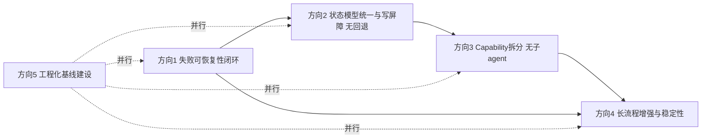
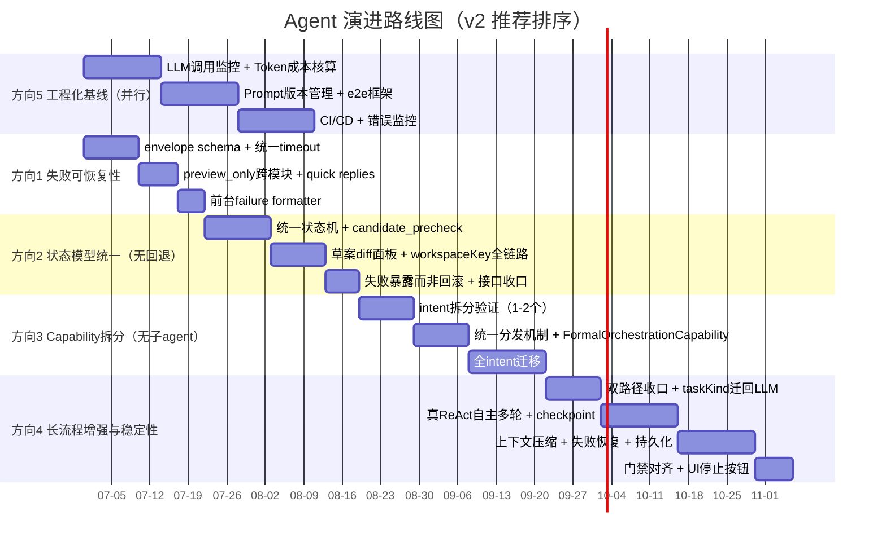

# Agent 发展方向与工程化方向技术方案

- 状态：待用户确认（v2：删除回退/子 agent，长流程改为增强与稳定性）
- 作者：solution-architect
- 日期：2026-06-28
- 修订说明：v2 基于"长流程已部分融入但未闭环"的代码现状重审，参考 codex 模式删除回退与子 agent 雏形，将方向 4 重定位为长流程增强与稳定性。
- 适用范围：aibiandan agent 编排系统（电视播单 + 轮播单）
- 关联文档：`docs/agent-development-protocol.md`、`docs/agent-server-migration-plan.md`、`docs/architecture.md`、`docs/tech-debt.md`、`AGENTS.md` Goal 39/40

---

## 1. 背景与目标

### 1.1 当前 agent 能力边界

aibiandan 的编排 agent 已经走完第一阶段：在 LLM-first / LLM-only 主路径下，把短链路（播单创建、原子命令识别、电视/轮播策略分流、候选推荐确认/取消）打通，并以 13 条 safety gates、顺播硬约束、失败暴露文化作为底座。

**长流程已部分融入但未闭环**（v2 修订要点）：`AgentPlanner` 已支持 `formal_orchestration` action（`src/services/llm/agentPlanner.ts:44-48`），可通过自然语言触发"全天编排"和"整体补排"；`DemoRuntimeFacade` 已实现完整 bootstrap 门禁链路（空草案阻拦、部分草案引导、频道默认草案复用、轮播草案缺失阻拦、已有节目重编确认，`src/services/runtime/demoRuntimeFacade.ts:7569-7622`）；lifecycle 元数据（taskKind / playlistModel / canInterrupt / writesFormalPlaylist / suggestedBatchSize）已声明；版面草案三件套（prepare/refine/commit）已闭环且与正式播单隔离明确。但 facade 只产出 `kind: 'orchestration'` decision 后不执行编排、双路径并行（facade 产出请求 vs 老 `Orchestrator` 执行）、伪 ReAct、无 checkpoint/持久化/停止按钮、`taskKind` 仍依赖本地正则识别（违背 LLM-first）、长流程测试未纳入 `agent:check` 门禁。

已落地的关键能力：

- 单 capability（`AtomicCommandCapability`，6630+ 行）+ `DemoRuntimeFacade` 总控（10540 行）。
- 13 条 safety gates（顺播、连续剧倒序、时间重叠、版面边界、轮播策略等）。
- LLM-first / LLM-only 主路径：禁止本地关键词分类改写用户意图。
- SSE 双路径（A 流式 + B 批量回放）+ 多策略关键词重试。
- 失败暴露三态：`llm_intent_unavailable` / `capability_route_conflict` / `unable_to_decide`。
- 候选检索重试（已实现）、`candidate_judge_llm` 断言、`needs_selection` 失败暴露。

### 1.2 用户期望

用户对下一步 agent 的期望是：

1. 足够强大智能，能承接用户的各种节目编排需求（含长流程）。
2. 设计上参考成熟 agent（Codex / Claude Code / Trae / LangGraph 等），前台体验对齐。
3. 明确架构缺陷与更明确的工程化方向，避免继续在缺陷上叠加功能。
4. **（v2 修订）全天编排/补全/草案已融入到整体流程**：长流程不是从零接入，而是基于已落地的 AgentPlanner action + bootstrap 门禁 + 草案三件套做增强与稳定性补强，重点在于收口双路径、迁回 LLM-first、补齐 checkpoint 与持久化、纳入门禁，而非推倒重来。
5. **（v2 修订）不引入回退功能**：参考 codex 模式，失败就暴露失败让用户重试或补充，不做自动回滚、不做 mutation journal 回滚链路。
6. **（v2 修订）不引入子 agent**：当前业务需求专一，当前项目本身就是典型的子 agent，不再叠加 DraftAgent/CandidateAgent/SelectionAgent/WriteAgent/ValidationAgent 子 agent 雏形，只保留按 intent 拆分 AtomicCommandCapability + 统一分发机制。

### 1.3 本方案定位

本方案是 agent 演进的"技术方案文档"，不是 sprint 排期。它解决三个问题：

- 现状到底差在哪（架构缺陷 + 工程化缺失 + 长流程未闭环点）。
- 下一步往哪走（5 个候选方向 + 推荐排序）。
- 怎么走才不踩坑（每个方向的接口设计、case 设计、验证门禁、风险权衡）。

本方案严格遵守 `AGENTS.md` 的 Agent Harness Protocol：LLM-first 不可妥协、本地只保护结果不可妥协、暴露失败不假装理解不可妥协、渐进式演进不一次性大重构。

**v2 定位收口**（基于用户反馈）：

- **不引入回退**：参考 codex 模式，失败时保留现场 + 暴露问题 + 让用户决定下一步，不做自动回滚、不做 mutation journal 回滚链路。本地逻辑只保护结果与暴露失败，不替用户回退已写入的状态。
- **不引入子 agent**：当前项目本身就是典型的子 agent，业务需求专一，不再叠加 DraftAgent/CandidateAgent/SelectionAgent/WriteAgent/ValidationAgent 子 agent 雏形。方向 3 只保留按 intent 拆分 AtomicCommandCapability + 统一分发机制。
- **聚焦失败可恢复性、状态模型统一、Capability 拆分、长流程增强与稳定性、工程化基线**五个方向，长流程（formal_orchestration / 补空窗 / 全天编排）作为已部分接入能力的稳定性补强，而非从零接入骨架。

---

## 2. 现状评估

### 2.1 已实现能力清单与优势

| 能力 | 实现位置 | 优势说明 |
|---|---|---|
| LLM-first / LLM-only 主路径 | `src/services/agent/atomicCommandCapability.ts` | 删除本地关键词改写，开放意图完全交给 LLM |
| 顺播硬约束 | safety gates + `DemoRuntimeFacade` | 电视剧/连续剧不倒序、不跳播、不重复 |
| 失败暴露文化 | `llm_intent_unavailable` 等 | 不假装理解，允许用户重试或补充 |
| SSE 双路径 | path A 流式 + path B 批量回放 | 流式体验 + 降级容错 |
| 多策略关键词重试 | 候选检索 | 内容匹配 / 收视率 / 热播策略切换 |
| 候选 judge LLM 断言 | `candidate_judge_llm` | 候选选择可解释、可追溯 |
| 13 条 safety gates | `DemoRuntimeFacade` | 写入前最后一道确定性保护 |
| Capability 注册机制 | `CapabilityRegistry` | 已具备注册与分发骨架 |
| ReAct 数据结构 | `reactTaskRuntime` | maxTurns=4、batchSize=5 已定义 |
| session 持久化 | `AgentServerSessionStore` | 内存态 + 可选 file persist |
| **（v2 新增）长流程 action 接入** | `src/services/llm/agentPlanner.ts:44-48` | `formal_orchestration` action 已可由自然语言触发，覆盖"全天编排"与"整体补排" |
| **（v2 新增）长流程 bootstrap 门禁** | `src/services/runtime/demoRuntimeFacade.ts:7569-7622` | 空草案阻拦、部分草案引导、频道默认草案复用、轮播草案缺失阻拦、已有节目重编确认已闭环 |
| **（v2 新增）长流程 lifecycle 元数据** | facade 内 taskKind / playlistModel / canInterrupt / writesFormalPlaylist / suggestedBatchSize | 长流程任务可中断性、写入范围、建议批量已可声明 |
| **（v2 新增）版面草案三件套** | prepare / refine / commit | 草案生成、精修、提交闭环，且与正式播单隔离明确 |

### 2.2 架构缺陷清单（A1-A16，按严重程度排序）

**P0 致命级**：

- **A1 DemoRuntimeFacade 单点瓶颈**：`src/services/runtime/demoRuntimeFacade.ts` 10540 行，承担意图分发、顺播校验、轮播策略、草案/正式播单 mutation、SSE 编排、session 管理、trace 落盘等 10+ 类职责。任何新功能都要改这一个文件，回归成本极高。
- **A2 AtomicCommandCapability 单类过大**：`src/services/agent/atomicCommandCapability.ts` 6630+ 行，8 种 intent（move/insert/replace/delete/batchMove/batchDelete/query/validate）全部塞进一个类，单测覆盖困难。
- **A3 双分发机制并行**：`CapabilityRegistry` 只注册 `AtomicCommandCapability`，而 `DemoRuntimeFacade.tryHandleAgentPlannerInstruction` 走独立 if-else 链，两套路由并存，`capability_route_conflict` 只在 registry 侧生效，planner 侧绕过。
- **A4 草案/正式播单/pending mutation 状态模型不统一**：draft reference、draft pending mutation、formal playlist、formal pending mutation 四种状态散落，没有统一 owner / workspaceKey / mutationId / mutationPolicy 契约。**（v2 修订）状态机统一仍要做，但失败时不自动回滚，改为暴露失败让用户重试或补充，对齐 codex 模式。**
- **A5 timeout/deadline 分散不一致**：6s / 8s / 12s / 15s / 30s / 60s / 140s 多套并存，无整体 deadline，无 AbortController 联动，长流程下 timeout 雪崩。
- **A14（v2 新增）长流程双路径并行**：facade 产出 `kind: 'orchestration'` decision 后不执行编排，实际多时段编排执行依赖老 `Orchestrator` 类（`src/services/orchestrator.ts:199`，独立路径，未被 facade 引用），形成 facade 产出请求 vs Orchestrator 执行两套并行路径，状态、checkpoint、停止信号、生命周期均不统一。
- **A15（已修复）补空窗 taskKind 本地正则识别已删除**：正式编排的 `taskKind` 现在只接受 LLM `formal_orchestration` action 返回；本地仅做枚举、模式组合和写入门禁校验。
- **A16（v2 新增）长流程测试门禁未跟上**：`demoRuntimeFacade.fullGenerateBootstrap.test.ts` 与 `orchestrator.test.ts` 均不在 `agent:check:tests` 列表中，长流程行为变化无门禁保护。文档 `docs/agent-development-protocol.md:99` 仍写"补空窗和全天编排不纳入 agent:check 强制门禁"，代码已突破但门禁未跟上。

**P1 高优级**：

- **A6 preview_only / noMutation 未跨模块硬约束**：`preview_only` 在 intent 解析层有，但 pending mutation、write adapter 层无强制字段传递，存在 preview_only 误写风险。
- **A7 workspaceKey 过滤不完整**：message / detail / pending / recoverable failure / server session replay 链路中 workspaceKey 断点，跨工作区污染风险。
- **A8 失败 envelope 非结构化**：失败暴露只有错误码 + 散文 message，无 recognizedSlots / missingSlots / candidateEvidence / retrySuggestions 结构，前台无法生成 quick replies。
- **A9 候选推荐散文输出**：候选推荐靠 prompt 让 LLM 输出散文，无法进入编排闭环（无法生成可点击 card、无法结构化 reasonTags）。
- **A10 LLM 调用不可观测**：仅有 trace + audit 计数，无 tokenUsage / latencyMs / cost / errorMessage 聚合，无法做成本核算与性能回归。

**P2 中优级**：

- **A11 ChatPanel.vue 5100+ 行**：前台单文件过大，状态管理与 UI 耦合，与后台拆分节奏不匹配。
- **A12 无 e2e 测试**：仅 `goal37` 脚本与 unit + `agent:check`，无真 e2e 覆盖。
- **A13 浏览器端直连 LLM**：部分 LLM 调用仍在浏览器端，与 Goal 39/40 服务端优先冲突，密钥暴露与可观测性双重问题。

### 2.3 工程化缺失清单

| 工程化能力 | 现状 | 影响 |
|---|---|---|
| LLM 调用监控 | 仅 trace + audit 计数 | 无法定位慢调用、失败调用 |
| Token 成本核算 | 无 | 无法做预算与回归 |
| Prompt 版本管理 | 写死在 `systemPrompts.ts` | 无法 A/B、无法回滚 |
| 回归测试基线 | 仅 unit + `agent:check` | 无真实 LLM 评估基线 |
| e2e 测试 | 仅 `goal37` 脚本 | 前台交互变更无门禁 |
| CI/CD | 无 `.github/workflows` | 依赖人工跑门禁 |
| 错误监控 | 无 Sentry | 线上失败不可见 |
| 性能监控 | 无 APM | 长流程性能不可测 |
| 日志聚合 | 仅 session 内 | 跨 session 不可查 |
| 密钥扫描 | 无自动化 | 提交前依赖人工 |

### 2.4 与成熟 agent 对比矩阵

| 维度 | 本项目 | Codex | Claude Code | Trae | LangGraph |
|---|---|---|---|---|---|
| LLM-first | 强约束 | 是 | 是 | 部分 | 否 |
| 失败暴露 | 是（缺结构化） | 是 | 是 | 是 | 异常传播 |
| 真 ReAct 循环 | 否（伪 ReAct，每轮需用户触发） | 否 | 是（自主多轮） | 是 | 是 |
| Tool calling 协议 | 否（JSON prompt） | 自定义 | 原生 tool_use | skill + tool | 原生 |
| Plan/Act 分离 | 部分 | 否 | 是 | 是 | 是 |
| 上下文压缩 | 否（仅 truncation） | 否 | 是 | 是 | 是（checkpoint） |
| 持久化 | file session store（**长流程任务持久化未实现**） | 文件 | 文件 + memory | 项目 memory | checkpoint store |
| 业务硬约束 | 是（顺播） | 否 | 否 | 否 | 否 |
| 监控可观测 | 仅 trace + audit | 否 | 否 | 否 | LangSmith |

**结论**：本项目在"业务硬约束 + LLM-first + 失败暴露"三件事上领先，但在"真 ReAct / 上下文压缩 / 长流程持久化与可观测"四件事上落后。**（v2 修订）本项目不引入子 agent（当前项目本身就是子 agent，业务需求专一），下一步演进聚焦失败可恢复、状态模型统一、Capability 拆分、长流程增强与稳定性、工程化基线五个方向，同时不能丢掉已有的业务硬约束优势。**

---

## 3. 设计原则

以下原则贯穿全部 5 个方向，任何设计决策冲突时以此为准：

### 3.1 不可妥协原则

1. **LLM-first / LLM-only**：开放自然语言理解必须保持 LLM 主路径，删除所有在 LLM 前或 LLM 后强行改写用户意图的本地关键词分类、续接、补意图、兜底澄清和隐藏限制。
2. **本地只保护结果**：本地逻辑只能保护结果（时间换算、写入校验、草案完整度判断、危险操作保护、正式播单和草案隔离、模型返回结构校验、执行边界和失败报错），不能替用户表达或改写意图。判断标准：代码如果是在"理解用户"，就是错误方向；如果是在"保护结果、校验写入或暴露失败"，就是允许保留。
3. **暴露失败不假装理解**：模型无法返回有效理解或可读解释时，必须像 Codex 一样暴露失败并允许用户重试或补充，不能由本地规则假装理解。

### 3.2 演进原则

4. **渐进式演进**：不一次性大重构。先拆 1-2 个 intent 验证模式，再推广；先做失败 envelope，再做状态机统一；先做骨架，再接长流程。
5. **短链路优先**：长流程接入前先把短链路做扎实（失败可恢复、状态模型统一、写屏障）。短链路不稳就接长流程，会放大 LLM 不稳定。
6. **工程化与业务并行**：工程化基线（方向 5）与业务方向（方向 1-4）并行推进，不阻断业务迭代，但工程化投入必须有可量化产出（token 成本、e2e 覆盖率、CI 通过率）。
7. **服务端优先**：所有 agent 主逻辑按 `AGENTS.md` Goal 39/40 服务端迁移边界，不应继续堆进 `DemoRuntimeFacade` 与浏览器端。长流程逻辑必须服务端化。

### 3.3 与 AGENTS.md 对齐

- Atomic Command Policy By Playlist Type：电视播单直接执行、轮播单候选推荐、删除始终确认。本方案的方向 1-4 都必须保留这条策略。
- Scheduling Guardrails：时间不重叠、不越界、连续剧不倒序、电视频道优先昨日历史、轮播单明确策略、字段级不匹配拒绝。本方案的状态模型统一（方向 2）必须把 guardrails 落到状态机契约里。

---

## 4. 整体演进路线图

### 4.1 方向依赖关系



依赖关系说明（v2 修订）：

- 方向 1 → 方向 2：失败 envelope 必须先于状态机统一，因为状态机失败暴露需要结构化失败信息才能让用户精确决定下一步。
- 方向 2 → 方向 3：状态模型统一后，Capability 拆分才能基于统一契约做职责分离，否则拆分后状态污染会放大。
- 方向 3 → 方向 4：Capability 拆分落地后，facade 才有正式的"执行器位置"承载长流程执行（`FormalOrchestrationCapability`），避免长流程逻辑继续堆进 `DemoRuntimeFacade`。
- 方向 1 → 方向 4：长流程的失败恢复直接复用方向 1 的 `RecoverableInterpretationFailure` envelope 与 `AgentDeadline`，必须先落地。
- 方向 5 与方向 1-4 并行：工程化基线不阻断业务，但方向 4 长流程增强前必须有方向 5 的 LLM 调用监控，否则长流程性能与成本不可测；同时方向 4 要求把长流程测试纳入 `agent:check:tests`，需要方向 5 的 e2e 框架支撑。

**v2 推荐排序**：方向 1（失败可恢复）→ 方向 2（状态模型统一，无回退）→ 方向 5（工程化基线，并行）→ 方向 3（Capability 拆分，无子 agent）→ 方向 4（长流程增强与稳定性）。方向 5 与方向 1-3 并行，方向 4 必须等方向 1 与方向 3 都到位后启动。

### 4.2 阶段时间序列（Gantt）



### 4.3 推荐排序与产出

| 阶段 | 方向 | 周期 | 前置依赖 | 产出 |
|---|---|---|---|---|
| 阶段 1 | 方向 1 失败可恢复性闭环 | 2-3 周 | 无 | recoverable envelope + 统一 timeout（含长流程整体 deadline）+ preview_only 跨模块 + 失败 quick replies |
| 阶段 2 | 方向 2 状态模型统一与写屏障（无回退） | 3-4 周 | 方向 1 | draft/pending/formal 状态机 + candidate_precheck + diff 面板 + workspaceKey 全链路 + 失败暴露而非回滚 |
| 阶段 3 | 方向 5 工程化基线建设（并行） | 2-3 周 | 无（与 1-2 并行） | LLM 监控 + Token 成本 + Prompt 版本 + e2e（含长流程）+ CI/CD |
| 阶段 4 | 方向 3 Capability 拆分（无子 agent） | 4-6 周 | 方向 2 | 按 intent 拆 capability + 统一分发机制 + FormalOrchestrationCapability（长流程执行器位置）|
| 阶段 5 | 方向 4 长流程增强与稳定性 | 5-7 周 | 方向 1 + 方向 3 + 方向 5 | 双路径收口 + taskKind 迁回 LLM + 真 ReAct 自主多轮 + checkpoint + 上下文压缩 + 失败恢复 + 任务持久化 + UI 停止按钮 + 门禁对齐 |

---

## 5. 方向 1：失败可恢复性闭环

### 5.1 recoverable_interpretation_failure envelope schema

当前失败暴露只有错误码 + 散文 message。本方向引入结构化 envelope，让前台能基于已识别线索生成 quick replies，让用户重试或补充而不是从头再来。

envelope schema 设计：

```typescript
/**
 * 可恢复失败信封结构。
 * 用于 LLM 意图解析失败、候选 0 命中、preview_only 违反等可恢复场景。
 * 前台据此生成 quick replies 与结构化失败展示。
 */
export interface RecoverableInterpretationFailure {
  /** 失败类型枚举 */
  kind:
    | 'llm_intent_unavailable'      // LLM 未返回有效意图
    | 'llm_timeout'                  // LLM 调用超时
    | 'candidate_zero_match'         // 候选 0 命中
    | 'candidate_field_conflict'     // 候选字段级不匹配
    | 'preview_only_violation'       // preview_only 被违反
    | 'unable_to_decide'             // 多候选无法决策
    | 'capability_route_conflict';   // capability 路由冲突
  /** LLM 已识别出的槽位（即使整体失败，部分槽位可能已有效） */
  recognizedSlots: RecognizedSlot[];
  /** 仍缺失的槽位（前台据此生成追问 quick replies） */
  missingSlots: MissingSlot[];
  /** 候选证据（候选 0 命中时为空数组；多候选时为候选摘要） */
  candidateEvidence: CandidateEvidence[];
  /** 重试建议（基于 recognizedSlots 推导出的可点击重试按钮） */
  retrySuggestions: RetrySuggestion[];
  /** 本次失败是否产生了任何 mutation（必须为 false 才允许 quick retry） */
  noMutation: boolean;
  /** 前台可点击的 quick replies */
  quickReplies: QuickReply[];
  /** 人类可读的失败摘要（仅用于无 quick reply 时的兜底展示） */
  humanSummary: string;
  /** 关联的 traceId，便于排查 */
  traceId: string;
}

/** 已识别槽位 */
export interface RecognizedSlot {
  name: 'playlistType' | 'intent' | 'target' | 'timeRange' | 'programName' | 'column' | 'strategy';
  value: unknown;
  confidence: number; // 0-1
  source: 'llm' | 'user_input' | 'context';
}

/** 缺失槽位 */
export interface MissingSlot {
  name: RecognizedSlot['name'];
  reason: string;          // 为什么需要这个槽位
  suggestedValues?: unknown[]; // 可选的建议值（用于 quick reply）
}

/** 候选证据 */
export interface CandidateEvidence {
  programName: string;
  programCode: string;
  duration: number;
  score: number;
  reasonTags: string[];     // 例如 ['内容匹配', '收视率优先']
  rejectedReason?: string;  // 如果被拒绝，说明原因
}

/** 重试建议 */
export interface RetrySuggestion {
  /** 用户可点击的重试文案 */
  label: string;
  /** 点击后填充的指令模板（含占位符） */
  instructionTemplate: string;
  /** 重试策略 */
  strategy: 'resubmit' | 'switch_strategy' | 'narrow_target' | 'broaden_target';
}

/** 前台 quick reply */
export interface QuickReply {
  label: string;
  /** 点击后行为：补指令 / 切换策略 / 取消 */
  action: 'fill_instruction' | 'switch_strategy' | 'cancel';
  payload: unknown;
}
```

### 5.2 统一 timeout/deadline 策略

当前 6s / 8s / 12s / 15s / 30s / 60s / 140s 多套 timeout 并存，长流程下会雪崩。本方向引入请求级整体 deadline + AbortController + 5s 后可停止；短链默认整体 90s（可配置），单个 LLM stage 上限 45s，30s 不再作为复杂推理硬截止。

```typescript
/**
 * 统一 deadline 管理器。
 * 一次 submit 内所有 stage（intent / candidate / selection / write）共享一个整体 deadline，
 * 各 stage 只能从中扣除自己的预算，不能独立设置超时。
 */
export class AgentDeadline {
  private readonly startedAt: number;
  private readonly overallDeadlineMs: number;
  private readonly controller: AbortController;

  constructor(opts: { overallDeadlineMs?: number } = {}) {
    this.startedAt = Date.now();
    // 整体 deadline 默认 90s；复杂推理不承诺在固定30s内完成
    this.overallDeadlineMs = opts.overallDeadlineMs ?? 90_000;
    this.controller = new AbortController();
  }

  /** 获取剩余预算（ms），各 stage 用它判断是否还能继续 */
  public remainingMs(): number {
    return Math.max(0, this.overallDeadlineMs - (Date.now() - this.startedAt));
  }

  /** 5s 后触发 stoppable 信号（前台显示停止按钮） */
  public isStoppable(): boolean {
    return Date.now() - this.startedAt > 5_000;
  }

  /** 触发中止（用户点击停止） */
  public abort(): void {
    this.controller.abort();
  }

  /** 获取 abort signal，传给 fetch / LLM 调用 */
  public signal(): AbortSignal {
    return this.controller.signal;
  }
}

/**
 * 各 stage timeout 对齐表。
 * 各 stage 的 timeout 必须从 AgentDeadline.remainingMs 中扣除，不能写死。
 */
export const STAGE_TIMEOUT_BUDGET = {
  intent_parse: 8_000,      // LLM 意图解析
  candidate_search: 12_000, // 候选检索（含重试）
  candidate_judge: 8_000,   // 候选 judge LLM
  write_adapter: 5_000,     // 写入适配器
} as const;

/**
 * 长流程（formal_orchestration）timeout 策略。
 * v2 新增：长流程不能套用单次 submit 的 30s deadline，
 * 采用"整体 deadline + 分段 timeout + checkpoint 暂停"组合。
 */
export const LONG_RUNNING_DEADLINE_BUDGET = {
  /** 长流程整体 deadline（默认 10 分钟，可由 lifecycle.canInterrupt 与 UI 停止按钮提前中断） */
  overallDeadlineMs: 10 * 60 * 1000,
  /** 单批次 deadline（每批 checkpoint 不超过 90s，超时则暂停并保留 checkpoint） */
  batchDeadlineMs: 90 * 1000,
  /** 单个 stage 在长流程下沿用 STAGE_TIMEOUT_BUDGET，但允许从 batchDeadlineMs 中扣除 */
  stageInheritsShortBudget: true,
  /** 5s 后允许用户停止（与短链路一致） */
  stoppableAfterMs: 5_000,
} as const;

/**
 * 长流程 timeout 决策器。
 * 整体 deadline 用尽 → 暂停并保留 checkpoint；
 * 批次 deadline 用尽 → 暂停并保留 checkpoint，等用户"继续"；
 * 单 stage timeout → 复用方向 1 的 RecoverableInterpretationFailure 暴露失败。
 */
export function decideLongRunningTimeoutAction(
  elapsed: { overallMs: number; batchMs: number; stageMs: number },
  budget: typeof LONG_RUNNING_DEADLINE_BUDGET,
): 'continue' | 'pause_overall' | 'pause_batch' | 'expose_stage_failure' {
  if (elapsed.overallMs >= budget.overallDeadlineMs) {
    return 'pause_overall';
  }
  if (elapsed.batchMs >= budget.batchDeadlineMs) {
    return 'pause_batch';
  }
  // 单 stage timeout 由调用方按 STAGE_TIMEOUT_BUDGET 自行判断
  return 'continue';
}
```

**长流程 timeout 策略要点**（v2）：

- 长流程（`formal_orchestration` action 触发的全天编排 / 补空窗 / 整体补排）不套用 30s 短链路 deadline，采用 `LONG_RUNNING_DEADLINE_BUDGET` 的整体 10 分钟 + 批次 90s 组合。
- 整体 deadline 用尽时暂停并保留 checkpoint（不暴露 fatal failure，允许用户后续"继续"）。
- 批次 deadline 用尽时暂停并保留 checkpoint，emit `pause_batch` 信号，等用户在 UI 点击"继续"触发下一批。
- 单 stage timeout（如 LLM 调用 8s 超时）仍走方向 1 的 `RecoverableInterpretationFailure` envelope，由 `FailureRecovery`（方向 4 8.4）决定重试一次或暴露。
- UI 停止按钮触发 `AgentDeadline.abort()`，立即中止当前批次并保留已 checkpoint 的进度。

### 5.3 preview_only / noMutation 跨模块硬约束

`preview_only` 在 intent 解析层有，但 pending mutation、write adapter 层无强制字段传递。本方向引入 `mutationPolicy` 字段全链路传递。

```typescript
/**
 * Mutation 策略枚举。
 * 从 intent 解析层一路传递到 write adapter，任何层都不能私自降级。
 */
export type MutationPolicy =
  | 'preview_only'    // 仅预览，禁止任何 mutation（含 layout_draftUpdated）
  | 'pending_only'    // 只写 pending 状态，不写正式播单
  | 'formal_write';   // 写正式播单（受 safety gates 保护）

/**
 * Mutation 策略上下文。
 * 在 intent → planner → pending → write adapter 全链路传递。
 */
export interface MutationContext {
  policy: MutationPolicy;
  /** 触发该 mutation 的 message id */
  messageId: string;
  /** 所属 workspace */
  workspaceKey: string;
  /** mutation 唯一 id（用于 trace 关联与幂等性校验；v2 修订：不用于 journal 回滚，失败暴露而非回滚） */
  mutationId: string;
}

/**
 * 写屏障：write adapter 入口校验。
 * 任何 write adapter 调用前必须经过此校验，preview_only 时直接抛错。
 */
export function assertMutationAllowed(ctx: MutationContext, target: 'draft' | 'formal'): void {
  if (ctx.policy === 'preview_only') {
    throw new PreviewOnlyViolationError(target, ctx.mutationId);
  }
  if (ctx.policy === 'pending_only' && target === 'formal') {
    throw new PendingOnlyViolationError(target, ctx.mutationId);
  }
}
```

### 5.4 失败 quick replies

基于 `recognizedSlots` 生成可点击重试按钮。生成逻辑必须是确定性的（不是 LLM 生成），属于"保护结果"范畴。

```typescript
/**
 * 基于已识别槽位生成 quick replies。
 * 纯确定性逻辑，不调用 LLM，避免在失败路径上再引入 LLM 不稳定。
 */
export function generateQuickReplies(failure: RecoverableInterpretationFailure): QuickReply[] {
  const replies: QuickReply[] = [];

  // 缺失槽位 → 追问 quick reply
  for (const slot of failure.missingSlots) {
    if (slot.name === 'timeRange' && slot.suggestedValues?.length) {
      for (const v of slot.suggestedValues.slice(0, 2)) {
        replies.push({
          label: `时段：${String(v)}`,
          action: 'fill_instruction',
          payload: { slot: 'timeRange', value: v },
        });
      }
    }
    if (slot.name === 'strategy' && slot.suggestedValues?.length) {
      for (const v of slot.suggestedValues) {
        replies.push({
          label: `切换为${String(v)}`,
          action: 'switch_strategy',
          payload: { strategy: v },
        });
      }
    }
  }

  // 候选 0 命中 → 切换策略或放宽目标
  if (failure.kind === 'candidate_zero_match') {
    replies.push({
      label: '放宽关键词重试',
      action: 'fill_instruction',
      payload: { strategy: 'broaden_target' },
    });
  }

  // 始终提供取消
  replies.push({ label: '取消', action: 'cancel', payload: {} });
  return replies;
}
```

### 5.5 前台 failure formatter

前台需要把 envelope 结构化展示，而不是渲染散文。`ChatPanel.vue` 增加 `FailureFormatter.vue` 子组件。

```typescript
/**
 * 前台失败信封渲染数据。
 * ChatPanel 收到 envelope 后转换为该结构，传给 FailureFormatter.vue。
 */
export interface FailureRenderData {
  /** 一句话失败摘要 */
  headline: string;
  /** 已识别线索（槽位名 → 值） */
  recognizedHints: Array<{ label: string; value: string }>;
  /** 缺失槽位（红色高亮） */
  missingHints: Array<{ label: string; reason: string }>;
  /** 候选证据（如果有） */
  candidateCards: CandidateEvidence[];
  /** quick replies */
  quickReplies: QuickReply[];
  /** traceId（折叠展示） */
  traceId: string;
}

/**
 * envelope → 渲染数据转换函数（纯函数，便于单测）。
 */
export function formatFailureEnvelope(env: RecoverableInterpretationFailure): FailureRenderData {
  return {
    headline: env.humanSummary,
    recognizedHints: env.recognizedSlots.map((s) => ({
      label: SLOT_LABELS[s.name],
      value: formatSlotValue(s.value),
    })),
    missingHints: env.missingSlots.map((s) => ({
      label: SLOT_LABELS[s.name],
      reason: s.reason,
    })),
    candidateCards: env.candidateEvidence,
    quickReplies: generateQuickReplies(env),
    traceId: env.traceId,
  };
}
```

### 5.6 接口设计

| 接口 | 入参 | 出参 | 说明 |
|---|---|---|---|
| `emitRecoverableFailure(env)` | `RecoverableInterpretationFailure` | `void` | 在 LLM 失败 / 候选 0 命中 / preview_only 违反时由 capability 调用 |
| `AgentDeadline` | `{ overallDeadlineMs? }` | instance | 全链路 deadline 管理器 |
| `assertMutationAllowed(ctx, target)` | `MutationContext, 'draft' \| 'formal'` | `void \| throw` | write adapter 入口写屏障 |
| `generateQuickReplies(failure)` | `RecoverableInterpretationFailure` | `QuickReply[]` | 确定性 quick reply 生成 |
| `formatFailureEnvelope(env)` | `RecoverableInterpretationFailure` | `FailureRenderData` | 前台渲染数据 |

### 5.7 Case 设计

新增 case 落到 `agent:check` 强制门禁：

1. **case-llm-timeout**：LLM 调用超过 8s stage timeout，capability 必须返回 `kind: 'llm_timeout'` envelope，`noMutation: true`，前台展示 quick replies。
2. **case-llm-intent-empty**：LLM 返回空意图，必须返回 `kind: 'llm_intent_unavailable'`，`recognizedSlots` 为空数组，`missingSlots` 包含 `intent` 槽位。
3. **case-candidate-zero-match**：用户给出明确节目名，候选库字段级不匹配，必须返回 `kind: 'candidate_zero_match'`，`candidateEvidence` 为空数组，quick replies 包含"放宽关键词重试"。
4. **case-preview-only-violation**：preview_only 模式下 write adapter 被调用，`assertMutationAllowed` 必须抛 `PreviewOnlyViolationError`，envelope `kind: 'preview_only_violation'`。
5. **case-quick-reply-no-mutation**：任何 quick reply 触发重试前，必须校验上一轮 `noMutation === true`，否则禁止 quick retry（防止污染上下文）。

### 5.8 验证门禁

- 行为变化：运行上述 5 个 case 的 Vitest。
- Agent 编排链路变化：运行 `npm run agent:check`。
- 前台可见交互变化：在 `http://localhost:5173` 触发 LLM 超时（mock），验证 `FailureFormatter` 展示 recognizedSlots / missingSlots / quickReplies。
- 构建检查：`npm run build`。

---

## 6. 方向 2：状态模型统一与写屏障

### 6.1 统一状态机

当前 draft reference、draft pending mutation、formal playlist、formal pending mutation 四种状态散落。本方向引入统一状态契约。**（v2 修订）状态机统一仍要做，但失败时不自动回滚，改为暴露失败让用户重试或补充，对齐 codex 模式；`previousState` 仅用于 trace 展示与失败现场保留，不用于自动回滚。**

```typescript
/**
 * 统一状态机枚举。
 * 涵盖草案引用、草案 pending mutation、正式播单、正式播单 pending mutation 四种状态。
 */
export type PlaylistState =
  | 'draft_reference'           // 草案引用（用户尚未确认）
  | 'draft_pending_mutation'    // 草案待确认 mutation
  | 'formal_playlist'           // 正式播单
  | 'formal_pending_mutation';  // 正式播单待确认 mutation

/**
 * 统一状态契约。
 * 所有播单状态必须符合此契约，capability 与 write adapter 只能消费此契约。
 */
export interface PlaylistStateContract {
  /** 当前状态 */
  state: PlaylistState;
  /** 所有者（哪条 message 触发的） */
  owner: { messageId: string; workspaceKey: string };
  /** 所属 workspace */
  workspaceKey: string;
  /** 当前 pending 的 mutation id（无 pending 时为 null） */
  mutationId: string | null;
  /** mutation 策略 */
  mutationPolicy: MutationPolicy;
  /** 状态机转换时间戳 */
  transitionedAt: number;
  /** 上一个状态（v2 修订：仅用于 trace 展示与失败现场保留，不用于自动回滚） */
  previousState: PlaylistState | null;
  /** v2 新增：失败现场快照（失败时保留，供用户决定下一步，不自动回滚） */
  failureSnapshot?: { reason: string; observedAt: number; traceId: string };
}

/**
 * 状态机合法转换表。
 * 任何非法转换直接抛错，属于"保护结果"。
 */
export const VALID_TRANSITIONS: Record<PlaylistState, PlaylistState[]> = {
  draft_reference: ['draft_pending_mutation'],
  draft_pending_mutation: ['draft_reference', 'formal_playlist'],
  formal_playlist: ['formal_pending_mutation'],
  formal_pending_mutation: ['formal_playlist', 'draft_reference'],
};

/**
 * 状态机转换校验。
 */
export function assertValidTransition(from: PlaylistState, to: PlaylistState): void {
  if (!VALID_TRANSITIONS[from].includes(to)) {
    throw new InvalidStateTransitionError(from, to);
  }
}
```

### 6.2 candidate_precheck 写屏障

候选检索阶段绝不能触发 `layout_draftUpdated`，否则草案被污染。本方向引入 candidate_precheck 写屏障。

```typescript
/**
 * 候选检索写屏障。
 * 候选检索阶段必须经过此 precheck，确保不触发任何草案 mutation。
 */
export function candidatePrecheck(ctx: MutationContext): void {
  // 候选检索阶段强制 preview_only
  if (ctx.policy !== 'preview_only') {
    throw new CandidatePrecheckViolationError(ctx.policy);
  }
  // 候选检索阶段不能有 mutationId
  if (ctx.mutationId) {
    throw new CandidatePrecheckMutationIdLeakError(ctx.mutationId);
  }
}

/**
 * 候选检索适配器。
 * 包一层 precheck，确保底层检索逻辑无法触达 write adapter。
 */
export class CandidateSearchAdapter {
  public search(query: CandidateQuery, ctx: MutationContext): CandidateEvidence[] {
    candidatePrecheck(ctx);
    // 实际检索逻辑
    return this.doSearch(query);
  }
  private doSearch(query: CandidateQuery): CandidateEvidence[] {
    // ... 检索实现
    return [];
  }
}
```

### 6.3 草案变更 diff 面板

未确认前只显示 diff，不直接改草案。前台 `DraftDiffPanel.vue` 子组件。

```typescript
/**
 * 草案 diff 数据结构。
 * pending mutation 未确认前，前台只渲染 diff，不渲染最终草案。
 */
export interface DraftDiff {
  mutationId: string;
  /** 新增的节目条目 */
  additions: DraftDiffEntry[];
  /** 删除的节目条目 */
  deletions: DraftDiffEntry[];
  /** 移动的节目条目（from → to） */
  moves: DraftDiffMove[];
  /** 时间冲突预警 */
  timeConflicts: TimeConflictWarning[];
}

export interface DraftDiffEntry {
  programName: string;
  programCode: string;
  startTime: string;
  endTime: string;
  duration: number;
  column?: string;
}

export interface DraftDiffMove {
  entry: DraftDiffEntry;
  fromTime: string;
  toTime: string;
}

export interface TimeConflictWarning {
  /** 冲突的两个条目 */
  entries: [DraftDiffEntry, DraftDiffEntry];
  /** 冲突类型 */
  kind: 'overlap' | 'cross_boundary' | 'reverse_playback';
}

/**
 * 计算草案 diff（纯函数）。
 */
export function computeDraftDiff(
  currentDraft: DraftSnapshot,
  pendingMutation: DraftSnapshot,
): DraftDiff {
  // ... diff 计算逻辑
  return { mutationId: '', additions: [], deletions: [], moves: [], timeConflicts: [] };
}
```

### 6.4 workspaceKey 全链路一致

`workspaceKey` 在 message / detail / pending / recoverable failure / server session replay 链路中必须一致，任何断点都视为污染。

```typescript
/**
 * workspaceKey 全链路校验。
 * 在 message → detail → pending → recoverable failure → server session replay 每一跳都校验。
 */
export function assertWorkspaceKeyConsistent(
  nodes: Array<{ workspaceKey: string; node: string }>,
  expected: string,
): void {
  for (const n of nodes) {
    if (n.workspaceKey !== expected) {
      throw new WorkspaceKeyLeakError(n.node, n.workspaceKey, expected);
    }
  }
}

/**
 * server session replay 时的 workspaceKey 过滤。
 * replay 只能恢复当前 workspace 的状态，不能跨 workspace 污染。
 */
export function filterSessionByWorkspace<T extends { workspaceKey: string }>(
  session: T[],
  workspaceKey: string,
): T[] {
  return session.filter((s) => s.workspaceKey === workspaceKey);
}
```

### 6.5 失败暴露而非回滚

**v2 修订**：参考 codex 模式，pending mutation 取消或失败时**不自动回滚**。引入 `FailureExposurePolicy`：失败时保留现场 + 暴露问题 + 让用户决定下一步（重试 / 补充 / 放弃 / 手动修正）。

```typescript
/**
 * 失败暴露策略。
 * v2 新增：取代原 MutationJournalService 的回滚链路。
 * 失败时只保留现场与暴露问题，不自动回滚。
 */
export type FailureExposureAction =
  | 'expose_and_await_user'   // 暴露失败现场，等用户决定
  | 'expose_and_suggest_retry'// 暴露失败现场 + 建议重试上一小步（仅长流程单步失败时）
  | 'expose_and_keep_pending';// 暴露失败现场 + 保留 pending mutation 供用户查看

/**
 * 失败现场记录。
 * 失败时填充到 PlaylistStateContract.failureSnapshot，供前台展示与用户决策。
 */
export interface FailureExposureRecord {
  /** 关联的 mutationId */
  mutationId: string;
  /** 失败类型（与方向 1 envelope kind 对齐） */
  kind: RecoverableInterpretationFailure['kind'];
  /** 失败原因（人类可读，但不替用户做决策） */
  reason: string;
  /** 当前播单状态快照（保留现场，不回滚） */
  currentSnapshot: DraftSnapshot | FormalSnapshot;
  /** 建议的下一步动作（仅展示给用户，不自动执行） */
  suggestedActions: FailureExposureAction[];
  /** 观察时间 */
  observedAt: number;
  /** 关联 traceId */
  traceId: string;
}

/**
 * 失败暴露器。
 * 取代原回滚逻辑：失败时只记录现场与暴露，不修改播单状态。
 */
export class FailureExposer {
  /** 记录失败现场（不回滚，不修改播单） */
  public expose(record: FailureExposureRecord): RecoverableInterpretationFailure {
    // 保留 currentSnapshot 作为现场，不回滚
    // 仅返回 envelope 供前台展示与用户决策
    return {
      kind: record.kind,
      recognizedSlots: [],
      missingSlots: [],
      candidateEvidence: [],
      retrySuggestions: record.suggestedActions.includes('expose_and_suggest_retry')
        ? [{ label: '重试上一小步', instructionTemplate: '', strategy: 'resubmit' }]
        : [],
      noMutation: false, // 失败前可能已有部分 mutation，必须如实暴露
      quickReplies: this.buildQuickReplies(record.suggestedActions),
      humanSummary: record.reason,
      traceId: record.traceId,
    };
  }

  /** 根据建议动作生成 quick replies（确定性逻辑，不调用 LLM） */
  private buildQuickReplies(actions: FailureExposureAction[]): QuickReply[] {
    const replies: QuickReply[] = [];
    if (actions.includes('expose_and_suggest_retry')) {
      replies.push({ label: '重试上一小步', action: 'fill_instruction', payload: {} });
    }
    if (actions.includes('expose_and_keep_pending')) {
      replies.push({ label: '查看当前 pending', action: 'fill_instruction', payload: {} });
    }
    replies.push({ label: '取消', action: 'cancel', payload: {} });
    return replies;
  }
}
```

**失败暴露而非回滚的边界**（v2）：

- pending mutation 取消：不自动回滚已写入的部分；保留 `currentSnapshot` 作为现场，暴露 `expose_and_await_user`，让用户决定是放弃当前 pending 还是手动修正后继续。
- 写入中途失败（如 safety gate 阻断）：不自动回滚已写入条目；保留现场，暴露 `expose_and_keep_pending`，让用户查看 pending diff 后决定。
- 长流程单小步失败：仅此场景允许 `expose_and_suggest_retry`（与方向 4 8.4 失败恢复"只重试上一小步一次"对齐），但仍不自动回滚已成功写入的批次。
- 任何情况下，本地逻辑都不替用户回退已写入状态；本地只负责保护结果（safety gates 阻断非法写入）与暴露失败（envelope + 现场快照）。

### 6.6 接口设计

| 接口 | 说明 |
|---|---|
| `PlaylistStateContract` | 统一状态契约（含 `failureSnapshot` 失败现场） |
| `assertValidTransition(from, to)` | 状态机转换校验 |
| `candidatePrecheck(ctx)` | 候选检索写屏障 |
| `computeDraftDiff(current, pending)` | 草案 diff 计算（展示用，不回滚） |
| `assertWorkspaceKeyConsistent(nodes, expected)` | workspaceKey 全链路校验 |
| `FailureExposer` | 失败暴露器（v2 取代 MutationJournalService，不回滚） |

### 6.7 Case 设计

1. **case-cancel-no-rollback-expose**（v2 修订）：pending mutation 取消时，`FailureExposer.expose` 必须保留 `currentSnapshot` 作为现场，不自动回滚；返回的 envelope `kind` 必须与失败类型对齐，`noMutation: false` 如实暴露已写入部分。
2. **case-candidate-precheck-no-draft-update**：候选检索阶段调用 `CandidateSearchAdapter.search`，`layout_draftUpdated` 不能被触发，违反时抛 `CandidatePrecheckViolationError`。
3. **case-workspace-switch-no-pollution**：用户切换 workspace 后，pending mutation 不能跨 workspace 应用，`filterSessionByWorkspace` 必须过滤。
4. **case-state-transition-illegal**：`formal_playlist` 直接转 `draft_pending_mutation` 必须抛 `InvalidStateTransitionError`，状态保持原样不回滚。
5. **case-failure-exposure-keep-snapshot**（v2 新增）：safety gate 阻断写入时，`FailureExposer` 必须保留 `currentSnapshot` 与 `failureSnapshot`，不修改播单状态，前台展示失败现场 + quick replies。
6. **case-no-rollback-on-partial-write**（v2 新增）：长流程批量写入中途失败时，已成功写入的批次不回滚，失败批次暴露 `expose_and_suggest_retry`，用户可重试上一小步一次。

### 6.8 验证门禁

- 行为变化：运行上述 6 个 case 的 Vitest。
- Agent 编排链路变化：运行 `npm run agent:check`。
- 前台可见交互变化：在 `http://localhost:5173` 触发一次 pending mutation 失败，验证 `DraftDiffPanel` 显示失败现场 diff（不回滚）+ `FailureFormatter` 展示 quick replies（含"查看当前 pending"与"取消"）；点击取消验证现场保留而非回滚。
- 构建检查：`npm run build`。

---

## 7. 方向 3：Capability 拆分（无子 agent）

**v2 修订**：删除原 7.2 子 agent 雏形（DraftAgent/CandidateAgent/SelectionAgent/WriteAgent/ValidationAgent）。当前项目本身就是典型的子 agent，业务需求专一，不再叠加子 agent 雏形，只保留按 intent 拆分 AtomicCommandCapability + 统一分发机制 + 长流程执行器位置（`FormalOrchestrationCapability`）。

### 7.1 按 intent 拆分 AtomicCommandCapability

`AtomicCommandCapability` 6630+ 行，8 种 intent 全塞一个类。本方向按 intent 拆分。

```typescript
/**
 * Capability 基类。
 * 所有按 intent 拆分后的 capability 都继承此类。
 */
export abstract class BaseCapability {
  /** capability 唯一 id */
  public abstract readonly id: string;
  /** 支持的 intent 列表 */
  public abstract readonly supportedIntents: AtomicIntent[];

  /** 判断是否能处理该 intent */
  public canHandle(intent: AtomicIntent): boolean {
    return this.supportedIntents.includes(intent);
  }

  /** 处理入口 */
  public abstract handle(ctx: CapabilityContext): Promise<CapabilityResult>;

  /** capability metadata（用于 trace 与监控） */
  public abstract metadata(): CapabilityMetadata;
}

export type AtomicIntent =
  | 'move' | 'insert' | 'replace' | 'delete'
  | 'batch_move' | 'batch_delete'
  | 'query' | 'validate';

export interface CapabilityMetadata {
  id: string;
  supportedIntents: AtomicIntent[];
  /** 依赖的数据源 */
  requiredSources: ('draft' | 'formal' | 'candidate' | 'history')[];
  /** 触发的 safety gates */
  safetyGates: string[];
}
```

拆分清单：

- `MoveCapability`（move / batch_move）
- `InsertCapability`（insert）
- `ReplaceCapability`（replace）
- `DeleteCapability`（delete / batch_delete，删除始终确认）
- `QueryCapability`（query）
- `ValidateCapability`（validate）
- **（v2 新增）`FormalOrchestrationCapability`**：处理 `formal_orchestration` action（全天编排 / 整体补排 / 补空窗），作为长流程执行器位置，承接 facade 产出的 `kind: 'orchestration'` decision 并驱动实际编排（与方向 4 8.6 双路径收口对齐）。

### 7.2 统一分发机制

`DemoRuntimeFacade.tryHandleAgentPlannerInstruction` 改为通过 `CapabilityRegistry` 路由，消除双分发。**（v2 修订）`formal_orchestration` action 也接入 capability registry，由 `FormalOrchestrationCapability` 承接，避免长流程执行逻辑继续堆进 `DemoRuntimeFacade`。**

```typescript
/**
 * 统一 capability 分发器。
 * 取代 DemoRuntimeFacade.tryHandleAgentPlannerInstruction 的 if-else 链。
 * v2 修订：同时接管 formal_orchestration action 的路由。
 */
export class CapabilityDispatcher {
  constructor(private registry: CapabilityRegistry) {}

  public async dispatch(ctx: CapabilityContext): Promise<CapabilityResult> {
    const intent = ctx.parsedIntent;
    const action = ctx.plannerAction; // v2 新增：formal_orchestration 等 AgentPlanner action
    const capabilities = this.registry.all();

    // 短链路 intent 路由
    const matched = capabilities.filter((c) => c.canHandle(intent));
    if (matched.length > 1) {
      // capability_route_conflict 仍生效
      return emitRouteFailure('capability_route_conflict', intent, matched.map((c) => c.id));
    }
    if (matched.length === 1) {
      return matched[0].handle(ctx);
    }

    // v2 新增：长流程 action 路由（formal_orchestration）
    if (action === 'formal_orchestration') {
      const orchestrationCap = capabilities.find((c) => c.id === 'formal_orchestration');
      if (!orchestrationCap) {
        return emitRouteFailure('no_capability_for_action', intent, ['formal_orchestration']);
      }
      return orchestrationCap.handle(ctx);
    }

    return emitRouteFailure('no_capability', intent);
  }
}

/**
 * Capability 注册表（扩展）。
 */
export class CapabilityRegistry {
  private caps: BaseCapability[] = [];

  public register(cap: BaseCapability): void {
    this.caps.push(cap);
  }
  public all(): BaseCapability[] {
    return [...this.caps];
  }
}

/**
 * v2 新增：长流程执行 capability。
 * 承接 formal_orchestration action，驱动实际多时段编排。
 * 与方向 4 8.6 双路径收口对齐：facade 不再产出 decision 后悬空，
 * 而是由本 capability 调用 ReactExecutor / BatchCheckpointExecutor 执行。
 */
export class FormalOrchestrationCapability extends BaseCapability {
  public readonly id = 'formal_orchestration';
  public readonly supportedIntents: AtomicIntent[] = []; // 不走 intent 路由，走 action 路由

  public canHandle(intent: AtomicIntent): boolean {
    return false; // 不参与 intent 路由
  }

  /** 判断是否能处理该 action（v2 新增） */
  public canHandleAction(action: string): boolean {
    return action === 'formal_orchestration';
  }

  public async handle(ctx: CapabilityContext): Promise<CapabilityResult> {
    // 实际编排执行委托给方向 4 的 ReactExecutor / BatchCheckpointExecutor
    // 这里只做 dispatch 与 lifecycle 校验
    // ... 委托实现见方向 4
    return { kind: 'success', trace: { capabilityId: this.id, calls: [] }, output: undefined };
  }

  public metadata(): CapabilityMetadata {
    return {
      id: this.id,
      supportedIntents: [],
      requiredSources: ['draft', 'formal', 'candidate', 'history'],
      safetyGates: ['time_overlap', 'cross_boundary', 'reverse_playback', 'column_strategy'],
    };
  }
}
```

### 7.3 Capability 接口扩展

增加 `metadata` 字段，用于 trace 合并与监控。**（v2 修订）`MergedTrace` 不再包含 `subAgentCalls`（已删除子 agent），改为 `capabilityCalls` 记录 capability 内部模块调用链。**

```typescript
export interface CapabilityContext {
  parsedIntent: AtomicIntent;
  /** v2 新增：AgentPlanner action（formal_orchestration 等） */
  plannerAction?: string;
  workspaceKey: string;
  messageId: string;
  mutationCtx: MutationContext;
  deadline: AgentDeadline;
}

export interface CapabilityResult {
  kind: 'success' | 'recoverable_failure' | 'fatal_failure';
  /** 合并后的 trace（v2：capability 内部模块调用链，不再叫 subAgentCalls） */
  trace: MergedTrace;
  /** 失败时填充 */
  failure?: RecoverableInterpretationFailure;
  /** 成功时填充 */
  output?: unknown;
}

export interface MergedTrace {
  capabilityId: string;
  /** v2 修订：capability 内部模块调用链（不再叫 subAgentCalls） */
  calls: Array<{ module: string; stage: string; latencyMs: number; tokenUsage?: number }>;
}
```

### 7.4 渐进式迁移策略

不一次性拆完。先拆 1-2 个 intent 验证模式：

1. **阶段 3.1**：拆 `QueryCapability`（最简单，无 mutation），验证 `BaseCapability` 接口与 `CapabilityDispatcher`。
2. **阶段 3.2**：拆 `InsertCapability`（涉及候选检索 + 写入），验证 capability 内部模块协作（候选检索 / 选择 / 写入 / 校验作为内部函数，不抽成子 agent）。
3. **阶段 3.3**：拆剩余 intent（move / replace / delete / batch / validate）。
4. **阶段 3.4**：删除 `DemoRuntimeFacade.tryHandleAgentPlannerInstruction` 的 if-else 链，统一走 `CapabilityDispatcher`。
5. **阶段 3.5（v2 新增）**：接入 `FormalOrchestrationCapability`，把 `formal_orchestration` action 路由到该 capability，为方向 4 双路径收口提供执行器位置。

每阶段迁移完必须跑 `agent:check` 全量回归。

### 7.5 接口设计

| 接口 | 说明 |
|---|---|
| `BaseCapability` | capability 基类 |
| `CapabilityDispatcher` | 统一分发器（v2：含 action 路由） |
| `CapabilityRegistry` | 注册表扩展 |
| `FormalOrchestrationCapability` | v2 新增：长流程执行 capability |
| `MergedTrace` | capability 内部模块调用链 trace（v2：不再叫 subAgentCalls） |

### 7.6 Case 设计

1. **case-split-behavior-unchanged**：拆分后 `QueryCapability` 行为必须与原 `AtomicCommandCapability` 的 query 分支完全一致（基于现有 case 回归）。
2. **case-independent-trace**：拆分后每个 capability 产生独立 trace，`MergedTrace` 能正确合并内部模块调用链。
3. **case-capability-route-conflict-still-works**：两个 capability 同时 canHandle 同一 intent 时，`capability_route_conflict` 仍生效。
4. **case-dispatcher-replaces-if-else**：删除 `tryHandleAgentPlannerInstruction` if-else 链后，所有原 case 必须仍通过。
5. **case-formal-orchestration-routed**（v2 新增）：`formal_orchestration` action 必须路由到 `FormalOrchestrationCapability`，不再由 facade 直接产出 decision 后悬空；capability 调用链可追溯。

### 7.7 验证门禁

- 行为变化：运行上述 5 个 case 的 Vitest。
- Agent 编排链路变化：运行 `npm run agent:check`（拆分阶段每步都跑全量）。
- 前台可见交互变化：前台行为不变，无需前台验证（但需冒烟一次确认 SSE 流式正常）。
- 构建检查：`npm run build`。

---

## 8. 方向 4：长流程增强与稳定性

**v2 修订**：章节标题从"真 ReAct 循环与长流程接入骨架"改为"长流程增强与稳定性"。长流程（`formal_orchestration` action 触发的全天编排 / 补空窗 / 整体补排）已部分接入（AgentPlanner action + bootstrap 门禁 + 草案三件套已落地），本方向聚焦收口双路径、迁回 LLM-first、补齐 checkpoint 与持久化、纳入门禁、补齐 UI 停止按钮，而非从零接入骨架。

### 8.1 真 ReAct 循环执行器

当前 `executeReactAgentPlan`（`src/services/runtime/demoRuntimeFacade.ts:885-980`）只执行 firstAction 后 recordObservation 返回，没有 LLM 自主多轮 act→observe→decide，是伪 ReAct。本方向实现服务端自主多轮，**明确替代当前 `executeReactAgentPlan` 的 firstAction-only 模式**。

```typescript
/**
 * 真 ReAct 循环执行器。
 * 单次 submit 内 LLM 自主循环，maxTurns=4，
 * 仅在需要用户确认或达上限时暂停。
 */
export class ReactExecutor {
  constructor(
    private planner: PlannerAgent,
    private actors: Record<string, BaseCapability>,
    private deadline: AgentDeadline,
  ) {}

  public async run(initialInput: ReactInput): Promise<ReactResult> {
    const turns: ReactTurn[] = [];
    let input = initialInput;

    for (let turn = 0; turn < MAX_TURNS; turn++) {
      if (this.deadline.remainingMs() < MIN_TURN_BUDGET_MS) {
        return this.pause('deadline_exceeded', turns);
      }

      // decide：LLM 决定下一步
      const plan = await this.planner.decideNextAction(input, turns);
      if (plan.kind === 'need_user_confirm') {
        return this.pause('need_user_confirm', turns, plan.pendingAction);
      }
      if (plan.kind === 'done') {
        return this.complete(turns, plan.finalOutput);
      }

      // act：执行 action
      const actor = this.actors[plan.action.capabilityId];
      const result = await actor.handle(plan.action.capabilityCtx);

      // observe：收集 observation
      turns.push({ turn, plan, result, observedAt: Date.now() });
      input = { ...input, lastObservation: result };
    }

    return this.pause('max_turns_reached', turns);
  }

  private pause(reason: string, turns: ReactTurn[], pending?: unknown): ReactResult {
    return { kind: 'paused', reason, turns, pending };
  }
  private complete(turns: ReactTurn[], output: unknown): ReactResult {
    return { kind: 'completed', turns, output };
  }
}

const MAX_TURNS = 4;
const MIN_TURN_BUDGET_MS = 3_000;
```

### 8.2 批量 checkpoint 执行器

长流程（补空窗、全天编排）分批执行，每批完成后反馈已处理/剩余数量，用户说"继续"才处理下一批。**v2 修订：当前未实现 BatchCheckpointExecutor，本方向为新增实现。**

```typescript
/**
 * 批量 checkpoint 执行器。
 * 每批 N 个条目，完成后 emit checkpoint，等待用户"继续"。
 */
export class BatchCheckpointExecutor<T> {
  constructor(private batchSize: number = 5) {}

  public async runBatch(
    items: T[],
    handler: (item: T, ctx: MutationContext) => Promise<HandlerResult>,
    ctx: MutationContext,
  ): Promise<CheckpointSnapshot<T>> {
    const snapshot: CheckpointSnapshot<T> = {
      total: items.length,
      processed: 0,
      remaining: items.length,
      nextBatchStart: 0,
      completedItems: [],
      paused: false,
    };

    const batch = items.slice(0, this.batchSize);
    for (const item of batch) {
      const result = await handler(item, ctx);
      snapshot.completedItems.push({ item, result });
      snapshot.processed++;
      snapshot.remaining--;
    }
    snapshot.nextBatchStart = this.batchSize;
    snapshot.paused = true;
    return snapshot;
  }

  /** 用户说"继续"后，从 checkpoint 恢复 */
  public async resume<T>(
    snapshot: CheckpointSnapshot<T>,
    items: T[],
    handler: (item: T, ctx: MutationContext) => Promise<HandlerResult>,
    ctx: MutationContext,
  ): Promise<CheckpointSnapshot<T>> {
    const nextBatch = items.slice(snapshot.nextBatchStart, snapshot.nextBatchStart + this.batchSize);
    for (const item of nextBatch) {
      const result = await handler(item, ctx);
      snapshot.completedItems.push({ item, result });
      snapshot.processed++;
      snapshot.remaining--;
    }
    snapshot.nextBatchStart += this.batchSize;
    snapshot.paused = snapshot.remaining > 0;
    return snapshot;
  }
}

export interface CheckpointSnapshot<T> {
  total: number;
  processed: number;
  remaining: number;
  nextBatchStart: number;
  completedItems: Array<{ item: T; result: HandlerResult }>;
  paused: boolean;
}
```

### 8.3 上下文压缩

当前仅 truncation。本方向引入摘要层 + 按相关性排序 + 向量化检索预留。

```typescript
/**
 * Agent LLM 上下文包（扩展）。
 * 增加摘要层与相关性排序。
 */
export interface AgentLlmContextPackage {
  /** 摘要层：上一轮的压缩摘要 */
  summary: ContextSummary;
  /** 详细层：按相关性排序的上下文条目 */
  entries: ContextEntry[];
  /** 当前轮的硬约束提示（顺播、版面边界等） */
  hardConstraints: string[];
  /** 向量化检索预留（本阶段不实现，仅占位） */
  retrievalHint?: { enabled: false; vectorIndex: null };
}

export interface ContextSummary {
  /** 已完成的 action 数 */
  completedActions: number;
  /** 关键决策点（LLM 自己生成的摘要） */
  keyDecisions: string[];
  /** 未解决的问题 */
  openQuestions: string[];
  /** 摘要生成的 token 消耗 */
  summaryTokenUsage: number;
}

export interface ContextEntry {
  /** 相关性分数（0-1，1 最相关） */
  relevanceScore: number;
  /** 条目类型 */
  kind: 'user_message' | 'agent_action' | 'observation' | 'safety_gate_block';
  /** 条目内容 */
  content: unknown;
  /** 时间戳 */
  timestamp: number;
}

/**
 * 上下文压缩器。
 * 当 entries 超过阈值时，调用 LLM 生成 summary，并按相关性排序保留 top N。
 */
export class ContextCompressor {
  private readonly maxEntries = 20;

  public async compress(ctx: AgentLlmContextPackage): Promise<AgentLlmContextPackage> {
    if (ctx.entries.length <= this.maxEntries) {
      return ctx;
    }
    const summary = await this.generateSummary(ctx.entries);
    const sorted = [...ctx.entries].sort((a, b) => b.relevanceScore - a.relevanceScore);
    const top = sorted.slice(0, this.maxEntries);
    return { ...ctx, summary, entries: top };
  }

  private async generateSummary(entries: ContextEntry[]): Promise<ContextSummary> {
    // ... LLM 摘要生成
    return { completedActions: 0, keyDecisions: [], openQuestions: [], summaryTokenUsage: 0 };
  }
}
```

### 8.4 失败恢复

网络/模型/素材工具失败时，只允许重试上一小步一次，不无限重试。**v2 修订：明确不做自动回滚（对齐 codex 模式与方向 2 6.5 失败暴露而非回滚）。失败时保留已成功写入的批次现场，仅允许重试失败的小步一次，第二次失败直接暴露。**

```typescript
/**
 * 失败恢复策略。
 * 只允许重试上一小步一次，第二次失败直接暴露。
 */
export class FailureRecovery {
  private retryCount: Map<string, number> = new Map();

  public canRetry(stepId: string): boolean {
    const count = this.retryCount.get(stepId) ?? 0;
    return count < 1;
  }

  public recordRetry(stepId: string): void {
    this.retryCount.set(stepId, (this.retryCount.get(stepId) ?? 0) + 1);
  }

  public handleFailure(stepId: string, error: unknown): RecoverableInterpretationFailure {
    if (this.canRetry(stepId)) {
      this.recordRetry(stepId);
      // 返回 retryable failure
      return this.buildRetryableFailure(stepId, error);
    }
    // 第二次失败，直接暴露
    return this.buildFatalFailure(stepId, error);
  }

  private buildRetryableFailure(stepId: string, error: unknown): RecoverableInterpretationFailure {
    return {
      kind: 'llm_timeout',
      recognizedSlots: [],
      missingSlots: [],
      candidateEvidence: [],
      retrySuggestions: [],
      noMutation: true,
      quickReplies: [{ label: '重试上一小步', action: 'fill_instruction', payload: { stepId } }],
      humanSummary: `步骤 ${stepId} 失败，可重试一次`,
      traceId: '',
    };
  }
  private buildFatalFailure(stepId: string, error: unknown): RecoverableInterpretationFailure {
    return {
      kind: 'unable_to_decide',
      recognizedSlots: [],
      missingSlots: [],
      candidateEvidence: [],
      retrySuggestions: [],
      noMutation: true,
      quickReplies: [],
      humanSummary: `步骤 ${stepId} 第二次失败，已暴露`,
      traceId: '',
    };
  }
}
```

### 8.5 长流程增强与稳定性 case

**v2 修订**：从"接入骨架 case"改为"增强与稳定性 case"，覆盖真 ReAct 自主多轮、批量 checkpoint、上下文压缩、失败重试上一小步、双路径收口、taskKind 迁回 LLM、门禁对齐。合并原 8.9 Case 设计的汇总 case。

**补空窗 case**：

1. **case-fill-gap-single**：单个空档（30 分钟），用户给出关键词，agent 自主检索候选 → 选择 → 写入。
2. **case-fill-gap-multiple-checkpoint**：多个空档（5 个），分批 checkpoint，每批 2 个，用户说"继续"。
3. **case-fill-gap-zero-candidate**：空档无候选匹配，暴露 `candidate_zero_match`，不强行编排。
4. **case-fill-gap-time-conflict-no-rollback**（v2 修订）：候选写入后触发时间冲突 safety gate，**不自动回滚**，保留失败现场 + 暴露 `expose_and_keep_pending`，让用户查看 pending diff 后决定。

**全天编排 case**：

1. **case-full-day-from-scratch**：从空版面全天编排，分时段 checkpoint。
2. **case-full-day-with-history**：基于昨日历史编排进度顺播，当前编排单已有节目优先。
3. **case-full-day-strategy-switch**：用户中途切换策略（内容匹配 → 收视率优先），agent 重新规划剩余时段。
4. **case-full-day-max-turns**：达到 maxTurns=4，暂停并提示用户"继续"。
5. **case-full-day-deadline**：整体 deadline 超时，暂停并保留 checkpoint。

**增强与稳定性 case**（v2 新增合并）：

1. **case-react-auto-multi-turn**：单次 submit 内 agent 自主完成 3 轮 act→observe→decide，无需用户触发，替代 `executeReactAgentPlan` firstAction-only 模式。
2. **case-context-compress-no-loss**：entries 超过 20 条触发压缩，关键决策点不丢失（基于 case 回归断言）。
3. **case-failure-retry-once-no-rollback**（v2 修订）：步骤失败后重试一次成功，恢复执行，已成功写入的批次不回滚。
4. **case-failure-retry-twice-fatal**：步骤第二次失败，直接暴露，不无限重试，不自动回滚。
5. **case-dual-path-converged**（v2 新增）：`formal_orchestration` action 经 `FormalOrchestrationCapability` 路由后，facade 不再产出 decision 后悬空，老 `Orchestrator` 路径被收口或由 facade 驱动。
6. **case-taskkind-from-llm**（v2 新增）：`formal_orchestration` action 由 LLM 直接返回 taskKind 字段，`resolveFormalOrchestrationTaskKind` 本地正则识别被删除或仅作兜底校验。
7. **case-long-running-test-in-agent-check**（v2 新增）：`demoRuntimeFacade.fullGenerateBootstrap.test.ts` 与 `orchestrator.test.ts` 纳入 `agent:check:tests`，长流程行为变化受门禁保护。

### 8.6 双路径收口

**v2 新增**：消除 facade 产出请求 vs 老 `Orchestrator` 执行的双路径并行（A14）。

```typescript
/**
 * 双路径收口策略。
 * v2 新增：facade 内置执行器或 facade 驱动 Orchestrator，
 * 消除 facade 产出 kind:'orchestration' decision 后悬空、
 * 实际执行依赖老 Orchestrator（src/services/orchestrator.ts:199）的双路径并行。
 */
export type DualPathConvergeStrategy =
  | 'facade_builtin_executor'   // facade 内置 ReactExecutor/BatchCheckpointExecutor 执行
  | 'facade_drives_orchestrator'; // facade 通过 FormalOrchestrationCapability 驱动老 Orchestrator

/**
 * 双路径收口决策器。
 * 优先采用 facade_builtin_executor（与方向 3 FormalOrchestrationCapability + 方向 4 ReactExecutor 对齐）；
 * 若老 Orchestrator 复用成本高，过渡期采用 facade_drives_orchestrator。
 */
export function decideDualPathConverge(
  hasFormalOrchestrationCapability: boolean,
  hasReactExecutor: boolean,
): DualPathConvergeStrategy {
  if (hasFormalOrchestrationCapability && hasReactExecutor) {
    return 'facade_builtin_executor';
  }
  return 'facade_drives_orchestrator';
}
```

**双路径收口要点**（v2）：

- 优先方案：`facade_builtin_executor`——`FormalOrchestrationCapability`（方向 3 7.2）直接调用 `ReactExecutor`（8.1）与 `BatchCheckpointExecutor`（8.2），老 `Orchestrator` 的编排逻辑被迁入或废弃。
- 过渡方案：`facade_drives_orchestrator`——`FormalOrchestrationCapability` 保留为执行器位置，但内部委托老 `Orchestrator` 执行编排，统一生命周期、checkpoint、停止信号入口。
- 收口后，老 `Orchestrator` 的 `cancel()` 能力被 facade 的 `AgentDeadline.abort()` 统一接管，消除"只有老 Orchestrator 路径有 cancel()"的不一致。
- 收口必须先做方向 3 Capability 拆分，否则 facade 内置执行器会进一步扩大 `DemoRuntimeFacade`（见 11.7 双路径收口风险）。

### 8.7 taskKind 迁回 LLM

**v2 新增**：把 `resolveFormalOrchestrationTaskKind`（`src/services/runtime/demoRuntimeFacade.ts:7608`）的本地正则识别改为 LLM 在 `formal_orchestration` action 中直接返回 taskKind 字段（对齐 `AGENTS.md` LLM-first，解决 A15）。

```typescript
/**
 * formal_orchestration action 的 LLM 返回结构扩展。
 * v2 新增：taskKind 由 LLM 直接返回，本地不再用正则识别。
 */
export interface FormalOrchestrationPlanFromLlm {
  /** LLM 决定的任务类型（全天编排 / 整体补排 / 补空窗） */
  taskKind: 'full_day_arrange' | 'overall_refill' | 'fill_gap';
  /** LLM 决定的目标时段（如有） */
  targetTimeRanges?: Array<{ start: string; end: string }>;
  /** LLM 决定的策略（轮播单必填） */
  strategy?: 'content_match' | 'rating_first' | 'hot_first';
  /** LLM 给出的分批建议（与 lifecycle.suggestedBatchSize 对齐） */
  suggestedBatchSize?: number;
  /** LLM 给出的可中断性建议 */
  canInterrupt?: boolean;
}

/**
 * taskKind 迁回 LLM 后的本地兜底校验。
 * v2 新增：本地只做结构校验与失败暴露，不做正则识别。
 * LLM 未返回 taskKind 或返回非法值时，暴露 llm_intent_unavailable，不替用户猜测。
 */
export function assertTaskKindFromLlm(plan: FormalOrchestrationPlanFromLlm): void {
  const validKinds: FormalOrchestrationPlanFromLlm['taskKind'][] = [
    'full_day_arrange',
    'overall_refill',
    'fill_gap',
  ];
  if (!validKinds.includes(plan.taskKind)) {
    throw new TaskKindUnavailableError(plan.taskKind);
  }
}
```

**taskKind 迁回 LLM 要点**（v2）：

- `AgentPlanner` 的 `formal_orchestration` action prompt 增加 `taskKind` 字段要求，LLM 必须返回 `full_day_arrange / overall_refill / fill_gap` 之一。
- 删除 `resolveFormalOrchestrationTaskKind` 的本地正则识别逻辑，仅保留 `assertTaskKindFromLlm` 的结构校验与失败暴露。
- LLM 未返回 taskKind 或返回非法值时，暴露 `llm_intent_unavailable` envelope，让用户重试或补充（对齐 codex 模式与方向 1 失败暴露）。
- 风险：LLM 可能不稳定返回 taskKind，需要方向 5 监控覆盖率与方向 1 失败暴露兜底（见 11.8 taskKind 迁回 LLM 风险）。

### 8.8 门禁对齐

**v2 新增**：把 `demoRuntimeFacade.fullGenerateBootstrap.test.ts` 与 `orchestrator.test.ts` 纳入 `agent:check:tests`，长流程行为变化受门禁保护（解决 A16）。

```typescript
/**
 * agent:check:tests 门禁扩展。
 * v2 新增：长流程测试纳入门禁。
 */
export const AGENT_CHECK_TESTS_V2 = {
  /** 原有短链路 case */
  shortChainCases: [
    'tests/agent/atomicCommandCapability.test.ts',
    'tests/agent/capabilityRegistry.test.ts',
    // ... 原有 case
  ],
  /** v2 新增：长流程 case */
  longRunningCases: [
    'tests/runtime/demoRuntimeFacade.fullGenerateBootstrap.test.ts',
    'tests/services/orchestrator.test.ts',
    'tests/agent/formalOrchestrationCapability.test.ts', // v2 新增
    'tests/agent/reactExecutor.test.ts',                 // v2 新增
    'tests/agent/batchCheckpointExecutor.test.ts',       // v2 新增
  ],
};

/**
 * 门禁对齐校验。
 * v2 新增：agent:check 启动时校验长流程 case 已纳入，未纳入则门禁失败。
 */
export function assertLongRunningTestsInAgentCheck(tests: string[]): void {
  const required = AGENT_CHECK_TESTS_V2.longRunningCases;
  const missing = required.filter((t) => !tests.includes(t));
  if (missing.length > 0) {
    throw new LongRunningTestsNotInAgentCheckError(missing);
  }
}
```

**门禁对齐要点**（v2）：

- `docs/agent-development-protocol.md:99` 的"补空窗和全天编排不纳入 agent:check 强制门禁"需同步更新为"长流程已纳入门禁"。
- `agent:check:tests` 列表新增长流程 case，CI/CD（方向 5 9.5）同步跑这些 case。
- 长流程 case 失败时门禁红灯，不允许合入。

### 8.9 任务持久化

`AgentServerSessionStore` 扩展支持长流程跨小时/跨天。**v2 修订：当前 LongRunningTaskStore 未实现，本方向为新增实现。**

```typescript
/**
 * 长流程任务持久化条目。
 * 跨小时/跨天的长流程任务必须持久化，不能只存内存。
 */
export interface PersistedLongRunningTask {
  taskId: string;
  workspaceKey: string;
  /** 任务类型 */
  kind: 'fill_gap' | 'full_day_arrange' | 'overall_refill';
  /** 当前 checkpoint */
  checkpoint: CheckpointSnapshot<unknown>;
  /** 创建时间 */
  createdAt: number;
  /** 最后更新时间 */
  updatedAt: number;
  /** 任务状态 */
  status: 'running' | 'paused' | 'completed' | 'failed';
  /** v2 新增：失败现场（失败时保留，不回滚） */
  failureSnapshot?: { reason: string; observedAt: number; traceId: string };
}

/**
 * 长流程任务 store（扩展 AgentServerSessionStore）。
 */
export class LongRunningTaskStore {
  private tasks: Map<string, PersistedLongRunningTask> = new Map();

  public save(task: PersistedLongRunningTask): void {
    task.updatedAt = Date.now();
    this.tasks.set(task.taskId, task);
    // 持久化到文件（file persist）
    this.persistToFile();
  }

  public load(taskId: string): PersistedLongRunningTask | null {
    return this.tasks.get(taskId) ?? null;
  }

  public listByWorkspace(workspaceKey: string): PersistedLongRunningTask[] {
    return [...this.tasks.values()].filter((t) => t.workspaceKey === workspaceKey);
  }

  private persistToFile(): void {
    // ... file persist 实现
  }
}
```

### 8.10 UI 停止按钮与后台运行

5s 后显示停止按钮、可后台运行。**v2 修订：当前 facade 主链路没有停止按钮，只有老 Orchestrator 路径有 cancel()，本方向为 facade 新增 AbortController 与可中断循环。**

```typescript
/**
 * 前台长流程任务状态。
 */
export interface LongRunningTaskUiState {
  taskId: string;
  /** 已处理数量 */
  processed: number;
  /** 剩余数量 */
  remaining: number;
  /** 是否可停止（5s 后） */
  stoppable: boolean;
  /** 是否后台运行 */
  backgroundRunning: boolean;
  /** 当前批次进度 */
  currentBatch: { index: number; total: number };
}

/**
 * 前台停止信号发送。
 */
export function sendStopSignal(taskId: string): void {
  // 通过 SSE / WebSocket 发送停止信号到服务端
  // 服务端调用 AgentDeadline.abort()
}
```

### 8.11 接口设计

| 接口 | 说明 |
|---|---|
| `ReactExecutor` | 真 ReAct 循环执行器（替代 executeReactAgentPlan firstAction-only） |
| `BatchCheckpointExecutor` | 批量 checkpoint 执行器（v2 新增实现） |
| `ContextCompressor` | 上下文压缩器 |
| `FailureRecovery` | 失败恢复（只重试一次，不回滚） |
| `LongRunningTaskStore` | 长流程任务持久化（v2 新增实现） |
| `LongRunningTaskUiState` | 前台长流程状态 |
| `sendStopSignal(taskId)` | 前台停止信号 |
| `decideDualPathConverge(...)` | v2 新增：双路径收口决策器 |
| `FormalOrchestrationPlanFromLlm` | v2 新增：taskKind 由 LLM 直接返回 |
| `assertTaskKindFromLlm(plan)` | v2 新增：taskKind 本地兜底校验（仅校验，不识别） |
| `assertLongRunningTestsInAgentCheck(tests)` | v2 新增：门禁对齐校验 |

### 8.12 验证门禁

- 行为变化：运行 16 个 case 的 Vitest（补空窗 4 + 全天编排 5 + 增强与稳定性 7）。
- Agent 编排链路变化：运行 `npm run agent:check`（长流程 case 纳入门禁，含 `demoRuntimeFacade.fullGenerateBootstrap.test.ts` 与 `orchestrator.test.ts`）。
- 前台可见交互变化：在 `http://localhost:5173` 触发补空窗长流程，验证：5s 后显示停止按钮、checkpoint 进度展示、点击"继续"恢复、点击停止中止并保留 checkpoint、失败时展示失败现场而非"已自动回滚"。
- 构建检查：`npm run build`。
- 门禁对齐校验：`assertLongRunningTestsInAgentCheck` 通过。

---

## 9. 方向 5：工程化基线建设

### 9.1 LLM 调用监控

```typescript
/**
 * LLM 调用审计条目。
 * 每次 LLM 调用都记录此条目，聚合到 trace。
 */
export interface AgentLlmCallAuditItem {
  /** 调用 id */
  callId: string;
  /** 关联 traceId */
  traceId: string;
  /** 调用 stage（intent_parse / candidate_judge / summary 等） */
  stage: string;
  /** 模型名 */
  model: string;
  /** token 用量 */
  tokenUsage: { prompt: number; completion: number; total: number };
  /** 延迟（ms） */
  latencyMs: number;
  /** 调用状态 */
  status: 'success' | 'timeout' | 'error' | 'aborted';
  /** 错误信息（失败时） */
  errorMessage?: string;
  /** 时间戳 */
  timestamp: number;
}

/**
 * LLM 调用监控聚合器。
 */
export class LlmCallMonitor {
  private items: AgentLlmCallAuditItem[] = [];

  public record(item: AgentLlmCallAuditItem): void {
    this.items.push(item);
  }

  /** 按 stage 聚合 */
  public aggregateByStage(): Record<string, StageAggregate> {
    const result: Record<string, StageAggregate> = {};
    for (const item of this.items) {
      if (!result[item.stage]) {
        result[item.stage] = { calls: 0, totalTokens: 0, totalLatencyMs: 0, errors: 0 };
      }
      result[item.stage].calls++;
      result[item.stage].totalTokens += item.tokenUsage.total;
      result[item.stage].totalLatencyMs += item.latencyMs;
      if (item.status !== 'success') {
        result[item.stage].errors++;
      }
    }
    return result;
  }
}

export interface StageAggregate {
  calls: number;
  totalTokens: number;
  totalLatencyMs: number;
  errors: number;
}
```

### 9.2 Token 成本核算

```typescript
/**
 * Token 成本核算。
 * 按 stage 聚合 token 用量，按模型计算成本。
 */
export const MODEL_PRICING: Record<string, { prompt: number; completion: number }> = {
  'gpt-4o': { prompt: 0.000005, completion: 0.000015 },   // 每 token 美元
  'gpt-4o-mini': { prompt: 0.00000015, completion: 0.0000006 },
  // 其他模型按需添加
};

/**
 * 计算成本。
 */
export function calculateCost(items: AgentLlmCallAuditItem[]): number {
  let cost = 0;
  for (const item of items) {
    const pricing = MODEL_PRICING[item.model];
    if (!pricing) {
      continue;
    }
    cost += item.tokenUsage.prompt * pricing.prompt;
    cost += item.tokenUsage.completion * pricing.completion;
  }
  return cost;
}
```

### 9.3 Prompt 版本管理

```typescript
/**
 * Prompt 版本管理。
 * systemPrompts.ts 增加 version 字段，支持 A/B 测试。
 */
export interface VersionedPrompt {
  /** prompt id */
  id: string;
  /** 版本号 */
  version: string;
  /** prompt 内容 */
  content: string;
  /** 启用状态 */
  enabled: boolean;
  /** 创建时间 */
  createdAt: number;
  /** A/B 测试分配比例（0-1） */
  trafficRatio?: number;
}

/**
 * Prompt 注册表。
 */
export class PromptRegistry {
  private prompts: Map<string, VersionedPrompt[]> = new Map();

  public register(prompt: VersionedPrompt): void {
    const list = this.prompts.get(prompt.id) ?? [];
    list.push(prompt);
    this.prompts.set(prompt.id, list);
  }

  /** 按 A/B 测试分配获取 prompt */
  public resolve(id: string, userId: string): VersionedPrompt {
    const list = this.prompts.get(id) ?? [];
    const enabled = list.filter((p) => p.enabled);
    if (enabled.length === 0) {
      throw new PromptNotAvailableError(id);
    }
    if (enabled.length === 1) {
      return enabled[0];
    }
    // 基于 userId hash 分配
    const hash = simpleHash(userId);
    const ratio = hash % 100 / 100;
    let cumulative = 0;
    for (const p of enabled) {
      cumulative += p.trafficRatio ?? 0;
      if (ratio <= cumulative) {
        return p;
      }
    }
    return enabled[enabled.length - 1];
  }
}

function simpleHash(s: string): number {
  let h = 0;
  for (let i = 0; i < s.length; i++) {
    h = (h * 31 + s.charCodeAt(i)) | 0;
  }
  return Math.abs(h);
}
```

### 9.4 e2e 测试框架

基于 Playwright 的真 e2e。

```typescript
/**
 * e2e 测试 fixture。
 * 模拟真实用户在 http://localhost:5173 的交互。
 */
export interface E2eFixture {
  /** fixture 名称 */
  name: string;
  /** 前置 mock（LLM 响应、候选库） */
  mocks: E2eMock[];
  /** 用户操作步骤 */
  steps: E2eStep[];
  /** 期望的最终状态 */
  expected: E2eExpected;
}

export interface E2eMock {
  kind: 'llm_response' | 'candidate_search' | 'safety_gate';
  payload: unknown;
}

export interface E2eStep {
  action: 'input' | 'click' | 'wait_for_sse' | 'assert_text';
  target?: string;
  value?: string;
  timeout?: number;
}

export interface E2eExpected {
  /** 期望的播单状态 */
  playlistSnapshot?: unknown;
  /** 期望的 UI 文本 */
  uiTextContains?: string[];
  /** 期望的失败 envelope */
  failureEnvelope?: Partial<RecoverableInterpretationFailure>;
}
```

e2e 测试 case 清单（首批 10 个 + v2 新增长流程 5 个，共 15 个）：

1. 新建电视播单 → 输入"在 19:00 插入新闻联播" → 验证草案 diff。
2. 新建轮播单 → 输入"插入 3 个综艺节目" → 验证候选 card。
3. 删除节目 → 验证确认提示。
4. LLM 超时 → 验证 failure formatter。
5. 候选 0 命中 → 验证 quick replies。
6. preview_only 违反 → 验证写屏障。
7. 补空窗长流程 → 验证 checkpoint + 停止按钮。
8. workspace 切换 → 验证不污染。
9. 顺播硬约束 → 验证连续剧不倒序。
10. 失败重试 → 验证 quick retry。
11. **（v2 新增）全天编排长流程**：输入"全天编排电视播单" → 验证 `formal_orchestration` action 触发 → 分时段 checkpoint → 用户点"继续"恢复 → 最终全天编排完成。
12. **（v2 新增）长流程失败暴露不回滚**：长流程写入中途触发 safety gate 阻断 → 验证失败现场保留（不回滚）+ `FailureFormatter` 展示 quick replies（含"查看当前 pending"与"取消"）。
13. **（v2 新增）长流程停止按钮**：长流程执行 5s 后 → 验证停止按钮出现 → 点击停止 → 验证当前批次中止 + checkpoint 保留 + 可后续"继续"。
14. **（v2 新增）长流程 taskKind 由 LLM 返回**：输入"补空窗" → 验证 `formal_orchestration` action 由 LLM 返回 `taskKind: 'fill_gap'` → 本地正则识别未被触发 → 编排按 fill_gap 策略执行。
15. **（v2 新增）长流程双路径收口**：触发 `formal_orchestration` → 验证经 `FormalOrchestrationCapability` 路由执行，老 `Orchestrator` 路径不再被独立触发（trace 中无并行路径）。

### 9.5 CI/CD

GitHub Actions 配置（或类似），跑 `agent:check` + build + lint + e2e。

```yaml
# .github/workflows/agent-ci.yml（示意，不在本方案中创建文件）
name: Agent CI
on: [push, pull_request]
jobs:
  lint:
    runs-on: ubuntu-latest
    steps:
      - uses: actions/checkout@v4
      - uses: actions/setup-node@v4
        with: { node-version: '20' }
      - run: npm ci
      - run: npm run lint
  build:
    runs-on: ubuntu-latest
    steps:
      - uses: actions/checkout@v4
      - uses: actions/setup-node@v4
        with: { node-version: '20' }
      - run: npm ci
      - run: npm run build
  agent-check:
    runs-on: ubuntu-latest
    steps:
      - uses: actions/checkout@v4
      - uses: actions/setup-node@v4
        with: { node-version: '20' }
      - run: npm ci
      - run: npm run agent:check
  e2e:
    runs-on: ubuntu-latest
    steps:
      - uses: actions/checkout@v4
      - uses: actions/setup-node@v4
        with: { node-version: '20' }
      - run: npm ci
      - run: npm run build
      - run: npx playwright install
      - run: npm run e2e
```

### 9.6 错误监控

Sentry 或类似。在 LLM 调用失败、safety gate 阻断、capability 路由冲突时上报。

```typescript
/**
 * 错误监控上报。
 * 仅上报失败信封，不上报用户原始输入（隐私保护）。
 */
export class ErrorMonitor {
  public report(failure: RecoverableInterpretationFailure): void {
    // Sentry.captureException 或类似
    // 仅上报 kind / traceId / noMutation，不上报原始 message
    this.doReport({
      kind: failure.kind,
      traceId: failure.traceId,
      noMutation: failure.noMutation,
      timestamp: Date.now(),
    });
  }
  private doReport(payload: unknown): void {
    // ... 实际上报
  }
}
```

### 9.7 接口设计

| 接口 | 说明 |
|---|---|
| `AgentLlmCallAuditItem` | LLM 调用审计条目 |
| `LlmCallMonitor` | 监控聚合器 |
| `calculateCost(items)` | Token 成本计算 |
| `VersionedPrompt / PromptRegistry` | Prompt 版本管理 |
| `E2eFixture` | e2e 测试 fixture |
| `ErrorMonitor` | 错误监控上报 |

### 9.8 验证门禁

- 行为变化：`LlmCallMonitor` 与 `calculateCost` 单测。
- Agent 编排链路变化：运行 `npm run agent:check`（确认监控不影响主链路）。
- 前台可见交互变化：无前台变化（监控为后台）。
- 构建检查：`npm run build` + `npm run lint`。
- CI/CD：GitHub Actions 跑通 lint + build + agent:check + e2e。

---

## 10. 前台体验升级（贯穿所有方向）

### 10.1 多气泡流式展示（已实现，需保持）

当前已实现 SSE 多气泡流式展示。后续方向必须保持此体验，不退化为单气泡。

- 方向 1：失败气泡也走流式（先 emit `recoverable_failure` 起泡，再流式补充 quick replies）。
- 方向 2：草案 diff 面板作为独立气泡，不与指令气泡合并。
- 方向 3：capability 拆分对前台透明，多气泡节奏不变。
- 方向 4：长流程每批 checkpoint 一个气泡，"继续"后起新气泡。

### 10.2 候选推荐结构化 card

取代散文输出。

```typescript
/**
 * 候选推荐 card 数据。
 * 取代当前散文输出，进入编排闭环。
 */
export interface CandidateRecommendationCard {
  programName: string;
  programCode: string;
  duration: number;
  /** 匹配分数（0-1） */
  score: number;
  /** 匹配原因标签 */
  reasonTags: string[];   // 例如 ['内容匹配', '收视率优先', '时长适配']
  /** 置信度 */
  confidence: number;
  /** "为什么是它"摘要（一句话） */
  whyThisOne: string;
  /** 用户可点击操作 */
  actions: Array<{ label: string; action: 'select' | 'reject' | 'detail' }>;
}
```

- 方向 1：候选 0 命中时，card 列表为空，展示 `candidate_zero_match` envelope。
- 方向 2：card 选择后进入 pending mutation，diff 面板展示。
- 方向 3：`InsertCapability` 内部选择模块输出 card 数据（v2 修订：原 `SelectionAgent` 已删除，改为 capability 内部函数）。
- 方向 4：长流程中每批 checkpoint 展示已选 card 列表。

### 10.3 失败结构化展示

`FailureFormatter.vue` 子组件，展示 recognizedSlots / missingSlots / retrySuggestions / quickReplies。

- 方向 1：本方向核心交付。
- 方向 2：状态矛盾失败也走 `FailureFormatter`。
- 方向 3：capability 路由冲突走 `FailureFormatter`。
- 方向 4：长流程失败恢复走 `FailureFormatter`（quick reply 含"重试上一小步"）。

### 10.4 草案 diff 面板

`DraftDiffPanel.vue` 子组件，未确认前只显示 diff。

- 方向 2：本方向核心交付。
- 方向 4：长流程每批 checkpoint 后，diff 面板累积展示已确认变更。

### 10.5 长流程进度

已处理/剩余数量 + 停止按钮 + 后台运行。

- 方向 4：本方向核心交付。
- 方向 5：e2e 测试覆盖长流程进度展示。

### 10.6 历史抽屉

播放单工作区历史。`HistoryDrawer.vue` 子组件。

- 方向 2：基于 trace 记录与 `PlaylistStateContract` 状态转换历史展示 mutation 历史（v2 修订：原 `MutationJournalService` 已删除，不再有 journal，改用 trace + 状态转换时间线）。
- 方向 4：长流程 checkpoint 历史也进抽屉。

### 10.7 主视图区分

版面草案 vs 正式播单明确区分。

- 方向 2：本方向核心交付（状态机统一后，主视图基于 `PlaylistStateContract.state` 渲染不同视觉）。

### 10.8 长流程进度展示

**v2 新增**：已处理/剩余数量 + 停止按钮 + 后台运行 + 分批 checkpoint 进度。

```typescript
/**
 * 前台长流程进度展示数据。
 * v2 新增：与方向 4 8.10 LongRunningTaskUiState 对齐，供 LongRunningProgress.vue 渲染。
 */
export interface LongRunningProgressRenderData {
  /** 任务类型（全天编排 / 整体补排 / 补空窗） */
  taskKind: 'full_day_arrange' | 'overall_refill' | 'fill_gap';
  /** 已处理数量 */
  processed: number;
  /** 剩余数量 */
  remaining: number;
  /** 总数量 */
  total: number;
  /** 当前批次进度（第几批 / 共几批） */
  currentBatch: { index: number; total: number };
  /** 是否可停止（5s 后） */
  stoppable: boolean;
  /** 是否后台运行 */
  backgroundRunning: boolean;
  /** 上一批次摘要（已选节目、已写入时段） */
  lastBatchSummary?: { writtenSlots: string[]; selectedPrograms: string[] };
  /** 下一批次预览（待处理时段） */
  nextBatchPreview?: { pendingSlots: string[] };
}
```

- 方向 4：本方向核心交付（与 8.10 UI 停止按钮与后台运行对齐）。
- 方向 5：e2e 测试覆盖长流程进度展示（含停止按钮、checkpoint 恢复）。
- 前台组件：`LongRunningProgress.vue`，独立气泡展示，不与指令气泡合并；每批 checkpoint 完成后更新进度，用户点"继续"后起新气泡承接下一批。

### 10.9 失败暴露而非回滚的 UI

**v2 新增**：失败时展示问题现场 + 重试建议，不展示"已自动回滚"。

```typescript
/**
 * 前台失败现场渲染数据。
 * v2 新增：与方向 2 6.5 FailureExposer 对齐，供 FailureScenePanel.vue 渲染。
 * 失败时展示现场快照与建议下一步，明确不展示"已自动回滚"。
 */
export interface FailureSceneRenderData {
  /** 失败摘要（一句话） */
  headline: string;
  /** 失败类型（与方向 1 envelope kind 对齐） */
  kind: RecoverableInterpretationFailure['kind'];
  /** 当前播单状态快照（保留现场，不回滚） */
  currentSnapshotSummary: {
    state: PlaylistState;
    pendingMutationId: string | null;
    /** 已写入条目数（如实暴露） */
    writtenEntryCount: number;
  };
  /** pending diff（如果有，供用户查看） */
  pendingDiff?: DraftDiff;
  /** 建议的下一步动作（仅展示，不自动执行） */
  suggestedActions: Array<{ label: string; action: string }>;
  /** quick replies */
  quickReplies: QuickReply[];
  /** traceId（折叠展示） */
  traceId: string;
  /** v2 明确：不展示"已自动回滚"提示，因为系统不做回滚 */
  rollbackNotice: false;
}
```

- 方向 1：失败 envelope 驱动本渲染数据。
- 方向 2：本方向核心交付（`FailureExposer` 产出 `currentSnapshot` 与 `suggestedActions`）。
- 方向 4：长流程失败时也走本 UI（quick replies 含"重试上一小步"）。
- 前台组件：`FailureScenePanel.vue`，与 `FailureFormatter.vue`（方向 1 5.5）协同，但额外展示失败现场快照与 pending diff，明确不展示"已自动回滚"文案。

---

## 11. 风险与权衡

### 11.1 大文件拆分风险

`AtomicCommandCapability`（6630+ 行）与 `DemoRuntimeFacade`（10540 行）拆分需要大量回归测试。

**权衡**：采用渐进式拆分（方向 3 阶段 3.1-3.4），每步拆 1-2 个 intent 后跑全量 `agent:check`。不一次性大重构。

**残余风险**：拆分过程中可能引入隐式行为变化（例如 trace 合并丢失）。通过 `case-split-behavior-unchanged` case 控制。

### 11.2 LLM 调用次数增加风险

**v2 修订**：删除"子 agent 协调"相关（已不引入子 agent）。真 ReAct 循环 + 长流程增强可能引入额外 LLM 调用。

**权衡**：Capability 拆分（方向 3）不引入额外 LLM 调用，仅做职责分离；真 ReAct 循环（方向 4）的 LLM 调用受 `maxTurns=4` 与 `AgentDeadline`（含长流程 `LONG_RUNNING_DEADLINE_BUDGET`）双重限制；`taskKind` 迁回 LLM（8.7）仅增加一次 LLM 返回字段，不增加调用次数。

**残余风险**：Token 成本上升。通过方向 5 的 Token 成本核算监控。

### 11.3 工程化投入不直接产出业务价值

难以排期。

**权衡**：方向 5 与业务方向并行，每 2 周一个可量化产出（监控覆盖率、e2e 通过率、CI 通过率）。不要求一次到位。

**残余风险**：工程化投入可能被业务需求挤压。通过 `AGENTS.md` Verification Gates 强制门禁守住底线。

### 11.4 长流程增强可能放大 LLM 不稳定

**v2 修订**：长流程已部分接入，增强阶段（双路径收口、taskKind 迁回 LLM、真 ReAct 自主多轮）可能放大 LLM 不稳定。需要方向 1 先落地。

**权衡**：方向 4 严格依赖方向 1（失败 envelope）+ 方向 2（状态机统一 + 失败暴露而非回滚）+ 方向 3（Capability 拆分 + `FormalOrchestrationCapability`）+ 方向 5（监控 + 门禁）。不跳过前置依赖。

**残余风险**：即使前置落地，长流程仍可能因 LLM 不稳定产生大量失败。通过 `FailureRecovery`（只重试一次，不回滚）+ `FailureExposer`（暴露现场）控制。

### 11.5 与 Goal 39/40 服务端迁移边界冲突

长流程逻辑不应继续堆进 `DemoRuntimeFacade`。

**权衡**：方向 3 拆分后，长流程逻辑落到 `CapabilityDispatcher` + `FormalOrchestrationCapability`（v2 修订：不再是子 agent），不进 `DemoRuntimeFacade`。方向 4 的 `ReactExecutor` / `BatchCheckpointExecutor` / `LongRunningTaskStore` 都是服务端独立模块。

**残余风险**：迁移过程中 `DemoRuntimeFacade` 仍承担部分职责，存在双写期。通过 `case-dispatcher-replaces-if-else` + `case-dual-path-converged` 控制迁移完整性。

### 11.6 过度工程化风险

**v2 修订**：原"子 agent 过度工程化"风险已随子 agent 删除而消失。当前阶段长流程增强可能引入过度工程化（如 ReactExecutor 自主多轮、BatchCheckpointExecutor、上下文压缩同时上）。

**权衡**：方向 4 长流程增强按"双路径收口 → taskKind 迁回 → 门禁对齐 → 真 ReAct → checkpoint → 上下文压缩 → 持久化 → UI 停止按钮"顺序渐进，每步落地后跑 `agent:check` 验证，不一次性全上。如果某一步验证后发现收益低于成本，可暂停后续步骤。

**残余风险**：长流程增强颗粒度过细，导致用户感知到的"停止/继续/重试"交互过于频繁。通过 8.5 增强与稳定性 case + 9.4 e2e 长流程 case 验证调整。

### 11.7 双路径收口风险

**v2 新增**：facade 内置执行器（`facade_builtin_executor`）可能进一步扩大 `DemoRuntimeFacade`，与 A1 单点瓶颈冲突。

**权衡**：双路径收口必须先做方向 3 Capability 拆分（`FormalOrchestrationCapability` 作为执行器位置），再由该 capability 调用 `ReactExecutor` / `BatchCheckpointExecutor`，执行器逻辑不进 `DemoRuntimeFacade`。若 Capability 拆分未完成，过渡期采用 `facade_drives_orchestrator`，统一入口但暂不迁入执行逻辑。

**残余风险**：过渡期 `facade_drives_orchestrator` 仍存在老 `Orchestrator` 的 `cancel()` 与 facade 的 `AgentDeadline.abort()` 双信号源问题。通过 `case-dual-path-converged` 控制收口完整性，门禁对齐（8.8）确保迁移期测试覆盖。

### 11.8 taskKind 迁回 LLM 风险

**v2 新增**：LLM 可能不稳定返回 `taskKind` 字段（漏返回、返回非法值、返回与用户意图不符的类型），导致长流程编排策略错误。

**权衡**：`assertTaskKindFromLlm`（8.7）只做结构校验与失败暴露，不做正则兜底识别；LLM 未返回或返回非法值时，暴露 `llm_intent_unavailable` envelope，让用户重试或补充（对齐 codex 模式与方向 1 失败暴露）。不替用户猜测 taskKind。

**残余风险**：LLM 在某些边界场景下稳定返回错误 taskKind（例如把"补空窗"识别为"全天编排"），本地校验无法发现。通过方向 5 LLM 调用监控 + 真实 LLM 评估基线（12.1）发现与修正；用户可通过 UI 停止按钮及时中止错误编排。

---

## 12. 残余风险与未覆盖点

### 12.1 真实 LLM 评估基线未建立

当前 `agent:check` 基于 mock LLM 响应。真实 LLM 的稳定性、准确率、成本无基线。

**未覆盖**：本方案方向 5 提供了监控与成本核算，但未设计真实 LLM 评估基线（例如固定 100 条指令的准确率回归）。建议在方向 5 落地后补充 `npm run agent:eval` 入口。

### 12.2 浏览器端直连 LLM 的迁移成本

A13（浏览器端直连 LLM）与 Goal 39/40 服务端优先冲突。本方案未详细设计迁移路径。

**未覆盖**：建议在方向 5 的 e2e 测试落地后，单独设计浏览器端 LLM 调用的服务端代理迁移方案。

### 12.3 mock 数据与真实节目库的差异

当前 case 基于 mock 节目库。真实节目库的字段完整度、收视率数据、历史编排记录可能与 mock 有差异。

**未覆盖**：本方案的 case 设计基于 mock，真实数据下的候选检索准确率未验证。建议在方向 5 的真实 LLM 评估基线中纳入真实节目库样本。

### 12.4 老 Orchestrator 与 facade 双路径收口的迁移成本

**v2 新增**：方向 4 8.6 双路径收口需要把老 `Orchestrator`（`src/services/orchestrator.ts:199`）的编排逻辑迁入 `FormalOrchestrationCapability` + `ReactExecutor`，或过渡期由 facade 驱动老 Orchestrator。两条路径的状态、checkpoint、停止信号、生命周期均不统一，迁移成本高。

**未覆盖**：本方案给出了 `facade_builtin_executor` 与 `facade_drives_orchestrator` 两种策略，但未详细设计老 Orchestrator 的逐函数迁移路径。建议在方向 3 Capability 拆分阶段 3.5（接入 `FormalOrchestrationCapability`）落地后，单独设计老 Orchestrator 的迁移与废弃计划，并通过 `case-dual-path-converged` + 门禁对齐（8.8）控制迁移完整性。

### 12.5 taskKind 迁回 LLM 后的稳定性

**v2 新增**：方向 4 8.7 把 `taskKind` 识别从本地正则迁回 LLM，对齐 LLM-first。但 LLM 可能不稳定返回 taskKind，导致长流程编排策略错误（如把"补空窗"识别为"全天编排"）。

**未覆盖**：本方案通过 `assertTaskKindFromLlm` 做结构校验与失败暴露，但无法识别"LLM 稳定返回错误 taskKind"的边界场景。建议在方向 5 LLM 调用监控落地后，建立 taskKind 返回准确率的真实 LLM 评估基线（与 12.1 真实 LLM 评估基线对齐），并在 prompt 中加入 few-shot 示例提升稳定性。用户可通过 UI 停止按钮及时中止错误编排。

### 12.6 跨会话 memory 积累未设计

当前 session 内的 context 仅 truncation + 方向 4 的摘要层。跨会话的 memory 积累（例如用户偏好、历史编排习惯）未设计。

**未覆盖**：跨会话 memory 需要 vector store + 长期记忆机制，超出当前阶段范围。建议在方向 4 的向量化检索预留落地后单独设计。

---

## 13. 附录

### 13.1 关键文件索引

| 文件 | 说明 |
|---|---|
| `src/services/agent/atomicCommandCapability.ts` | AtomicCommandCapability（6630+ 行，待拆分） |
| `src/services/runtime/demoRuntimeFacade.ts` | DemoRuntimeFacade 总控（10540 行，待拆分；v2 修正路径） |
| `src/services/agent/capabilityRegistry.ts` | Capability 注册表 |
| `src/services/agent/systemPrompts.ts` | Prompt 写死位置（待版本管理） |
| `src/services/agent/agentServerSessionStore.ts` | session 持久化 |
| `src/services/agent/safetyGates.ts` | 13 条 safety gates |
| `src/services/agent/reactTaskRuntime.ts` | ReAct 数据结构 |
| `src/services/llm/agentPlanner.ts` | v2 新增：AgentPlanner，含 `formal_orchestration` action（line 44-48） |
| `src/services/orchestrator.ts` | v2 新增：老 Orchestrator（line 199，双路径收口目标，待迁入 FormalOrchestrationCapability） |
| `src/services/gapManager.ts` | v2 新增：空档管理（补空窗长流程依赖） |
| `src/composables/useOrchestrator.ts` | v2 新增：前台编排 composable（长流程进度展示依赖） |
| `src/views/ChatPanel.vue` | 前台主面板（5100+ 行，待拆分） |
| `docs/agent-development-protocol.md` | Agent 开发协议（v2：line 99 长流程门禁需更新） |
| `docs/agent-server-migration-plan.md` | Goal 39/40 服务端迁移计划 |
| `docs/architecture.md` | 架构文档 |
| `docs/tech-debt.md` | 技术债清单 |
| `AGENTS.md` | Agent Harness Protocol |

### 13.2 与现有周报 P0/P1/P2 问题的对应关系

| 周报问题 | 优先级 | 本方案对应方向 |
|---|---|---|
| 失败可恢复 envelope | P0 | 方向 1（5.1） |
| 统一 timeout | P0 | 方向 1（5.2，含长流程整体 deadline） |
| preview_only 跨模块硬约束 | P0 | 方向 1（5.3） |
| workspace 隔离 | P0 | 方向 2（6.4） |
| 删除/插入确认兜底 | P0 | 方向 2（6.5 v2：失败暴露而非回滚） |
| 草案/正式/pending 状态模型统一 | P0 | 方向 2（6.1） |
| candidate_precheck 写屏障 | P0 | 方向 2（6.2） |
| 长流程双路径收口 | P0 | 方向 4（8.6 v2 新增） |
| taskKind 迁回 LLM | P0 | 方向 4（8.7 v2 新增） |
| 长流程门禁对齐 | P0 | 方向 4（8.8 v2 新增） |
| 长耗时任务停止与恢复 | P1 | 方向 4（8.10） |
| 候选推荐结构化 card | P1 | 前台 10.2 |
| 失败详情结构化 | P1 | 方向 1（5.1）+ 前台 10.9（v2 新增失败现场 UI） |
| 只读候选检索降级 | P1 | 方向 2（6.2 candidate_precheck） |
| 草案 diff 面板 | P1 | 方向 2（6.3） |
| 长流程进度展示 | P1 | 前台 10.8（v2 新增） |
| 素材检索重试（已实现） | P2 | 已完成 |
| 一键改写重试 | P2 | 方向 1（5.4 quick replies） |
| business evidence schema | P2 | 方向 5（9.1 audit item） |
| 播放单历史抽屉 | P2 | 前台 10.6 |
| 巡检证据导出 | P2 | 方向 5（9.1 监控聚合） |

### 13.3 与 AGENTS.md Goal 39/40 的对齐说明

- **Goal 39 服务端迁移边界**：方向 3 的 `CapabilityDispatcher` 与 `FormalOrchestrationCapability`（v2 修订：不再是子 agent）全部在服务端；方向 4 的 `ReactExecutor` / `BatchCheckpointExecutor` / `LongRunningTaskStore` 全部在服务端。前台只负责展示与 quick reply 回传。
- **Goal 40 服务端优先**：方向 1 的 `AgentDeadline` / `assertMutationAllowed` 在服务端 enforce；方向 2 的状态机 / candidate_precheck / 失败暴露而非回滚（v2 修订：原 mutation journal 已删除）在服务端 enforce。前台不持有任何 mutation 决策权。
- **Verification Gates 对齐**：每个方向的验证门禁都包含 `agent:check` + 前台冒烟 + 构建检查，与 `AGENTS.md` 一致。方向 4 8.8 门禁对齐后，长流程 case 也纳入 `agent:check:tests`。
- **v2 新增：长流程已部分接入，Goal 39/40 边界需更新**：`AgentPlanner.formal_orchestration` action、facade bootstrap 门禁、版面草案三件套已在服务端落地，但 `docs/agent-development-protocol.md:99` 仍写"补空窗和全天编排不纳入 agent:check 强制门禁"，`docs/current-status.md`（2026-04-03）未提到 AgentPlanner / formal_orchestration / ReAct / layout draft service，`docs/roadmap.md`（2026-04-02）提到"收口 orchestrator.ts 职责"但实际未收口。Goal 39/40 边界文档需同步更新为"长流程已部分接入服务端，门禁已纳入"。

### 13.4 与 project_memory 已有决策的对齐说明

| 已有决策 | 本方案对齐 |
|---|---|
| LLM-first | 设计原则 3.1.1，所有方向不可妥协 |
| 顺播硬约束 | 设计原则 3.3，方向 2 状态机契约落实 |
| SSE path A | 前台 10.1 保持多气泡流式 |
| 失败暴露 needs_selection | 方向 1 envelope `kind: 'unable_to_decide'` |
| 无顺播基线自动选最早一期 | 方向 4 长流程 case 沿用 |
| candidate_judge_llm 断言 | 方向 3 `InsertCapability` 内部模块沿用（v2 修订：原 SelectionAgent 已删除，改为 capability 内部函数） |
| koa-connect 坑 | 方向 5 CI/CD 注意 koa 中间件兼容 |
| LLM 30s timeout 坑 | 方向 1 `AgentDeadline` 默认 30s 对齐；长流程用 `LONG_RUNNING_DEADLINE_BUDGET`（v2 新增） |
| ready 标志过滤坑 | 方向 2 workspaceKey 全链路校验覆盖 |
| v2 新增：长流程已部分接入 | 方向 4 重定位为长流程增强与稳定性，基于已落地 action + bootstrap + 草案三件套增强 |
| v2 新增：不引入回退 | 方向 2 6.5 失败暴露而非回滚，方向 4 8.4 失败恢复不自动回滚 |
| v2 新增：不引入子 agent | 方向 3 只保留按 intent 拆分 + 统一分发 + FormalOrchestrationCapability |

---

## 章节目录

1. 背景与目标
2. 现状评估
   - 2.1 已实现能力清单与优势（v2：含长流程已部分融入）
   - 2.2 架构缺陷清单（A1-A16，v2：新增 A14 双路径并行 / A15 taskKind 本地正则 / A16 长流程门禁未跟上）
   - 2.3 工程化缺失清单
   - 2.4 与成熟 agent 对比矩阵（v2：删除子 agent 分工行，持久化行标注长流程未实现）
3. 设计原则
4. 整体演进路线图
   - 4.1 方向依赖关系（v2：方向 4 依赖方向 1 + 方向 3）
   - 4.2 阶段时间序列（Gantt）
   - 4.3 推荐排序与产出（v2：方向 1 → 方向 2 → 方向 5 → 方向 3 → 方向 4）
5. 方向 1：失败可恢复性闭环
   - 5.1 recoverable_interpretation_failure envelope schema
   - 5.2 统一 timeout/deadline 策略（v2：含长流程整体 deadline + 分段 timeout）
   - 5.3 preview_only / noMutation 跨模块硬约束
   - 5.4 失败 quick replies
   - 5.5 前台 failure formatter
   - 5.6 接口设计
   - 5.7 Case 设计
   - 5.8 验证门禁
6. 方向 2：状态模型统一与写屏障
   - 6.1 统一状态机（v2：失败时不自动回滚）
   - 6.2 candidate_precheck 写屏障
   - 6.3 草案变更 diff 面板
   - 6.4 workspaceKey 全链路一致
   - 6.5 失败暴露而非回滚（v2：取代原 mutation journal 与回滚）
   - 6.6 接口设计
   - 6.7 Case 设计
   - 6.8 验证门禁
7. 方向 3：Capability 拆分（无子 agent）
   - 7.1 按 intent 拆分 AtomicCommandCapability
   - 7.2 统一分发机制（v2：含 FormalOrchestrationCapability 接入）
   - 7.3 Capability 接口扩展
   - 7.4 渐进式迁移策略
   - 7.5 接口设计
   - 7.6 Case 设计
   - 7.7 验证门禁
8. 方向 4：长流程增强与稳定性
   - 8.1 真 ReAct 循环执行器（v2：替代 executeReactAgentPlan firstAction-only）
   - 8.2 批量 checkpoint 执行器
   - 8.3 上下文压缩
   - 8.4 失败恢复（v2：不自动回滚）
   - 8.5 长流程增强与稳定性 case
   - 8.6 双路径收口（v2 新增）
   - 8.7 taskKind 迁回 LLM（v2 新增）
   - 8.8 门禁对齐（v2 新增）
   - 8.9 任务持久化
   - 8.10 UI 停止按钮与后台运行
   - 8.11 接口设计
   - 8.12 验证门禁
9. 方向 5：工程化基线建设
   - 9.1 LLM 调用监控
   - 9.2 Token 成本核算
   - 9.3 Prompt 版本管理
   - 9.4 e2e 测试框架（v2：覆盖长流程 e2e case）
   - 9.5 CI/CD
   - 9.6 错误监控
   - 9.7 接口设计
   - 9.8 验证门禁
10. 前台体验升级（贯穿所有方向）
    - 10.1 多气泡流式展示
    - 10.2 候选推荐结构化 card
    - 10.3 失败结构化展示
    - 10.4 草案 diff 面板
    - 10.5 长流程进度
    - 10.6 历史抽屉
    - 10.7 主视图区分
    - 10.8 长流程进度展示（v2 新增）
    - 10.9 失败暴露而非回滚的 UI（v2 新增）
11. 风险与权衡（v2：删除子 agent 风险，新增 11.7 双路径收口风险 / 11.8 taskKind 迁回 LLM 风险）
12. 残余风险与未覆盖点（v2：删除多用户协作，新增 12.4 双路径收口迁移成本 / 12.5 taskKind 稳定性）
13. 附录
    - 13.1 关键文件索引（v2：补充 Orchestrator / GapManager / useOrchestrator / agentPlanner）
    - 13.2 与现有周报 P0/P1/P2 问题的对应关系
    - 13.3 与 AGENTS.md Goal 39/40 的对齐说明（v2：补充长流程已部分接入，边界需更新）
    - 13.4 与 project_memory 已有决策的对齐说明
